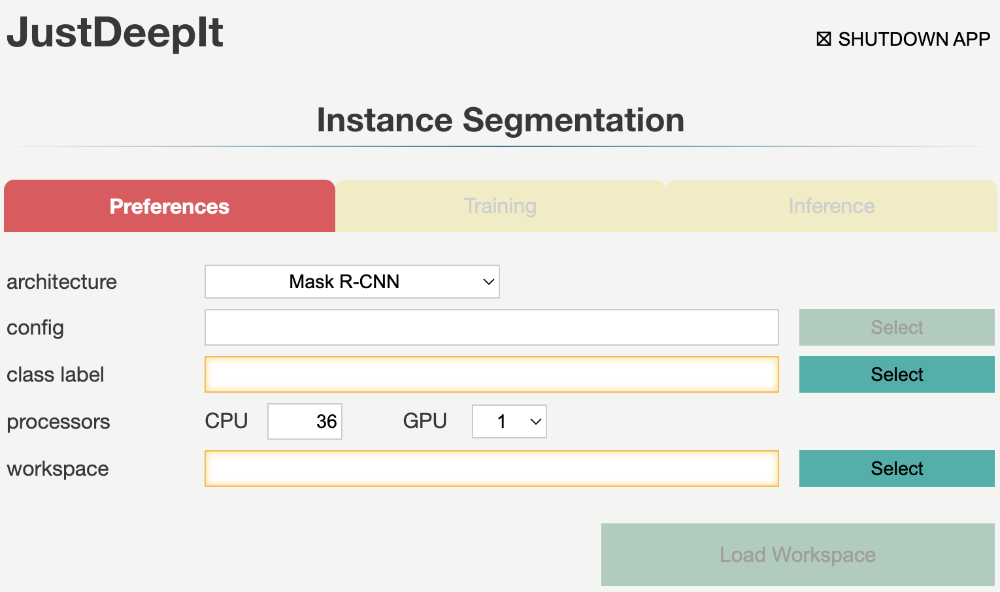
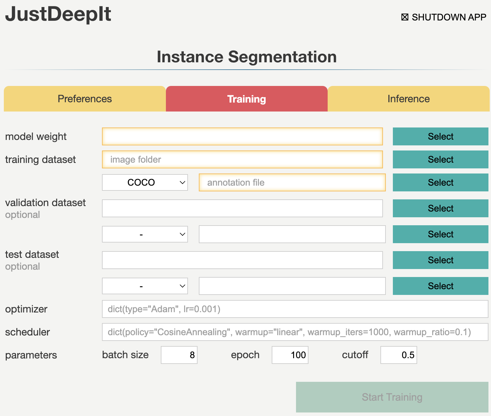
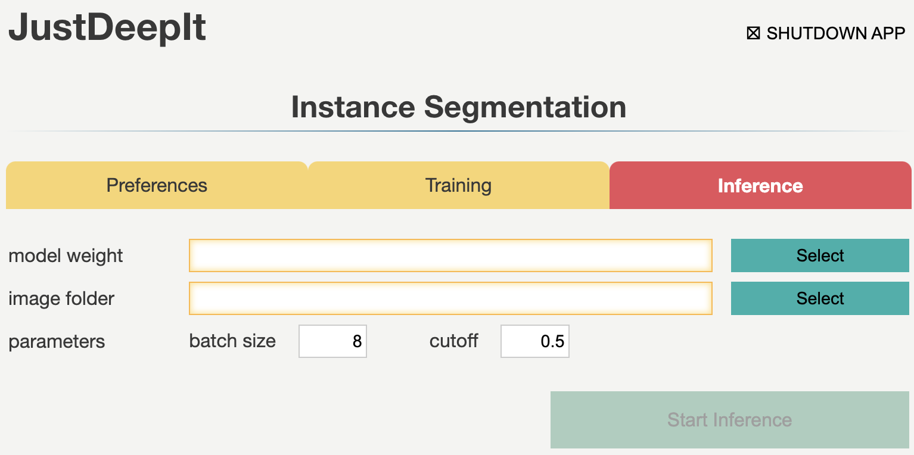

=====================
Instance Segmentation
=====================

Instance segmentation determines the pixelwise mask for each object in an image.
JustDeepIt internally calls the MMDetection library
to build instance segmentation models and perform model training and image segmentation.
The following image is an example of sugar beet and weed segmentation results with
Mask R-CNN using SugarBeets2016 dataset\ [#sugarbeet]_.

GUI
===

The GUI window for instance segmentation consists of three tabs:
**Preferences**, **Training**, and **Inference**.
These tabs are used for setting common parameters,
training models,
and inference (i.e., instance segmentation) from the test
images using the trained model, respectively.
Tabs **Training** and **Inference** are disabled
until the settings in tab **Preferences** are defined.

Preferences
-----------

Tab **Preferences** is used for setting common parameters,
such as the architecture of the segmentation model,
number of CPUs and GPUs to be used,
and the location (i.e., directory path) to the workspace
which is used to save intermediate and final results.
The required fields are highlighted with orange borders.
Detailed descriptions of the arguments are provided in the following table.

.. csv-table::
    :header: "Argument", "Description"
    
    "**backend**", "The backend to build an instance segmentation model.
    The current version of JustDeepIt supports MMDetection as a backend."
    "**architecture**", "Architecture of instance segmentation model. If ``custom`` is specified,
    user can use the customized configuration to generate a model."
    "**config**", "A path to a configuration file of MMDetection.
    This field will be activated when ``custom`` is specified in **architecture**."
    "**class label**", "A path to a text file which contains class labels.
    The file should be multiple rows with one column,
    and string in each row represents a class label
    (e.g., `class_label.txt <https://github.com/biunit/JustDeepIt/blob/main/tutorials/IS/data/class_label.txt>`_)."
    "**CPU**", "Number of CPUs."
    "**GPU**", "Number of GPUs."
    "**workspace**", "Workspace to store intermediate and final results."
 

Training
--------

Tab **Training** is used to train the model for instance segmentation.
It allows users to set general parameters of training,
such as the optimization algorithm, optimization scheduler, batch size, and number of epochs.
Detailed descriptions of the arguments are provided in the following table.

.. csv-table::
    :header: "Argument", "Description"
    
    "**model weight**", "A path to store the model weight.
    If the file is exists, then resume training from the given weight."
    "**image folder**", "A path to a folder which contains training images."
    "**annotation format**", "Annotation format."
    "**annotation**", "A path to a file (COCO format)."
    "**optimizer**", "A optimizer for model training. The supported optimizers can be checked from the
    `MMDetection website <https://mmdetection.readthedocs.io/en/latest/tutorials/customize_runtime.html>`_."
    "**scheduler**", "A scheduler for model training.  The supported schedulers can be checked from the
    `MMDetection website <https://mmdetection.readthedocs.io/en/latest/tutorials/customize_runtime.html>`_."
    "**batch size**", "Batch size."
    "**epochs**", "Number of epochs."
    "**cutoff**", "Cutoff of confidence score for training."

Inference
---------

Tab **Inference** is used for instance segmentation from test images using the trained model.
It allows the user to set the confidence score of instance segmentation results and batch size.

.. csv-table::
    :header: "Argument", "Description"
    
    "**model weight**", "A path to a trained model weight."
    "**image folder**", "A path to a folder contained multiple test images."
    "**batch size**", "Batch size."
    "**cutoff**", "Cutoff of confidence score for inference (i.e., instance segmentation)."
    

CUI
===

JustDeepIt implements three simple methods,
:meth:`train <justdeepit.models.IS.train>`,
:meth:`save <justdeepit.models.IS.save>`,
and :meth:`inference <justdeepit.models.IS.inference>`.
:meth:`train <justdeepit.models.IS.train>` is used for training the models,
while :meth:`save <justdeepit.models.IS.save>` is used for saving the trained weight,
and :meth:`inference <justdeepit.models.IS.inference>` is used for segmenting instances in test images.
Detailed descriptions of these functions are provided below.

Architectures
-------------

A neural network architecture for instance segmentation
can be initialized with class :class:`justdeepit.models.IS <justdeepit.models.IS>`.
For example, Mask R-CNN can be initialized by executing the following code.

.. code-block:: py

    from justdeepit.models import IS

    model = IS('./class_label.txt', model_arch='maskrcnn')

To initialize Mask R-CNN with the pre-trained weight
(e.g. the weight pre-trained with COCO dataset),
the argument ``model_weight`` can be used.
Note that, the weight file (:file:`.pth`) pre-trained with COCO dataset
can be downloaded from the GitHub repositories of
`MMDetection <https://github.com/open-mmlab/mmdetection/tree/master/configs>`_.

.. code-block:: py

    from justdeepit.models import IS

    weight_fpath = '/path/to/pretrained_weight.pth'
    model = IS('./class_label.txt', model_arch='maskrcnn', model_weight=weight_fpath)

Training
--------

Method :meth:`train <justdeepit.models.IS.train>` is used for the model training
and requires at least two arguments
to specify a folder containing the training images and annotations.
Annotations can be specified in a single file in the COCO format.
Refer to the API documentation of :meth:`train <justdeepit.models.IS.train>`
for detailed usage.

.. code-block:: py

    from justdeepit.models import IS

    train_images_dpath = '/path/to/folder/images'
    annotation_coco = '/path/to/coco/annotation.json'

    model = IS('./class_label.txt', model_arch='maskrcnn')
    model.train(train_images_dpath, annotation_coco)

The trained weight can be saved using method :meth:`save <justdeepit.models.IS.save>`,
which simultaneously stores the trained weight (:file:`.pth`)
and model configuration file (:file:`.py`).
Refer to the API documentation of :meth:`save <justdeepit.models.IS.save>`
for detailed usage.

.. code-block:: py

    model.save('trained_weight.pth')

Inference
---------

Method :meth:`inference <justdeepit.models.IS.inference>`
is used to perform instance segmentation against the test images using the trained model.
This method requires at least one argument to specify a single image,
list of images, or a folder containing multiple images.
The segmentation results are returned as class object
:class:`justdeepit.utils.ImageAnnotations <justdeepit.utils.ImageAnnotations>`.

To save the results in the COCO format,
we can use method :meth:`format <justdeepit.utils.ImageAnnotations.format>`
implemented in class :class:`justdeepit.utils.ImageAnnotations <justdeepit.utils.ImageAnnotations>`
to generate a JSON file in the COCO format.

.. code-block:: py

    from justdeepit.models import IS

    test_images = ['sample1.jpg', 'sample2.jpg', 'sample3.jpg']

    model = IS('./class_label.txt', model_arch='maskrcnn', model_weight='trained_weight.pth')
    outputs = model.inference(test_images)

    outputs.format('coco', './predicted_outputs.coco.json')

To save the segmentation results as images, for example,
showing the detected contours and bounding boxes on the images, method :meth:`draw <justdeepit.utils.ImageAnnotation.draw>`
implemented in class :class:`justdeepit.utils.ImageAnnotation <justdeepit.utils.ImageAnnotation>` can be used.

.. code-block:: py
    
    for output in outputs:
        output.draw('bbox+contour', os.path.join('./predicted_outputs', os.path.basename(output.image_path)))

Refer to the corresponding API documentation of
:meth:`inference <justdeepit.models.IS.inference>`,
:meth:`format <justdeepit.utils.ImageAnnotations.format>`, and
:meth:`draw <justdeepit.utils.ImageAnnotation.draw>`,
for the detailed usage.

References
===========

.. [#maskrcnn] He K, Gkioxari G, Dollár P, Girshick R. Mask R-CNN. https://arxiv.org/abs/1703.06870
.. [#sugarbeet] Chebrolu, N., Lottes, P., Schaefer, A., Winterhalter, W., Burgard, W., and Stachniss, C. (2017). Agricultural robot dataset for plant classification, localization and mapping on sugar beet fields. Int. J. Rob. Res. 36(10). doi: 10.1177/0278364917720510.
