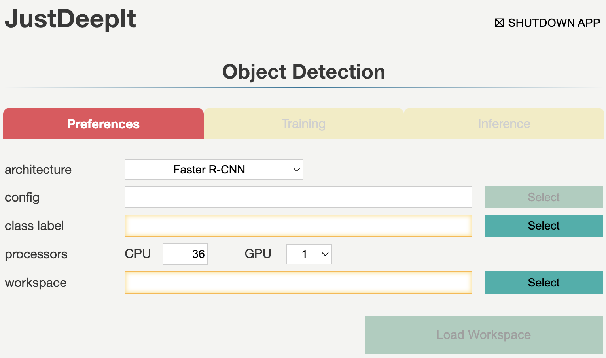
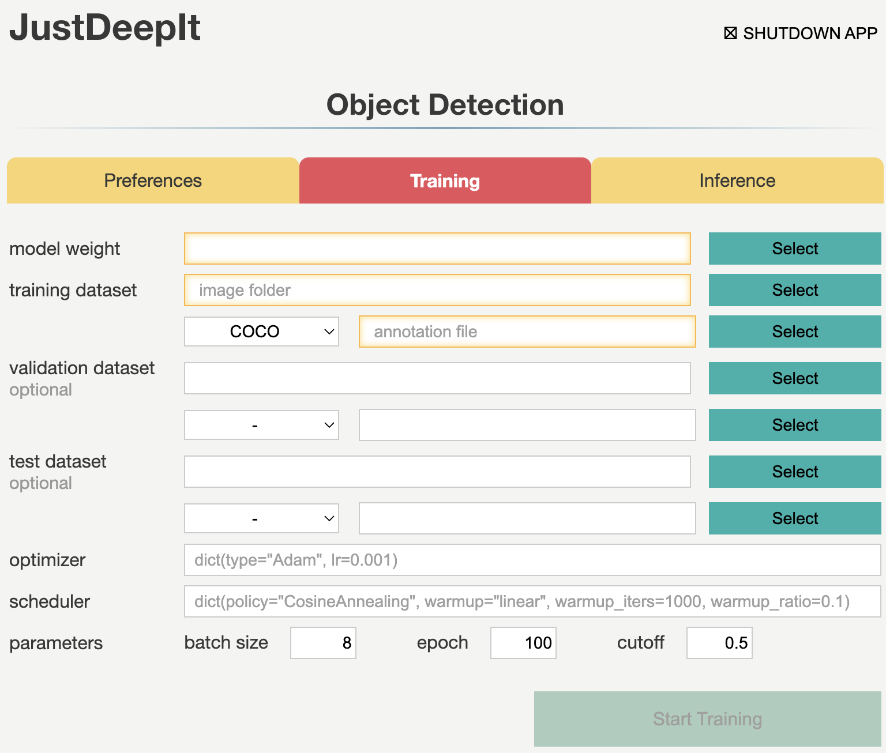

=====================
Instance Segmentation
=====================

Instance segmentation determines the pixelwise mask for each object in an image.
AgroLens internally calls the MMDetection or Detectron2 library
to build instance segmentation models and perform model training and image segmentation.
The latest version of AgroLens supports Mask R-CNN\ [#maskrcnn]_.

GUI
===

The GUI window for instance segmentation consists of three tabs:
**Preferences**, **Model Training**, and **Image Analysis**.
These tabs are used for setting common parameters,
training models,
and detecting objects from the test images using the trained model, respectively.
Tabs **Model Training** and **Image analysis** are disabled until the settings in tab **Preferences** are defined.

Preferences
-----------

Tab **Preferences** is used for setting common parameters,
such as the architecture of the detection model,
number of CPUs and GPUs to be used,
and the location (i.e., directory path) to the workspace
which is used to save intermediate and final results.

Detailed descriptions of the arguments are provided in the following table.

.. csv-table::
    :header: "Argument", "Description"
    
    "**Backend**", "The backend to build an instance segmentation model.
    The current version of AgroLens supports MMDetection and Detectron2 as a backend."
    "**Architecture**", "Architecture of instance segmentation model."
    "**Config**", "A path to a configuration file of MMDetection or Detectron2.
    If the path is not given, then use the default configuration file defined in AgroLens."
    "**Class label**", "A path to a text file which contains class labels.
    The file should be multiple rows with one column,
    and string in each row represents a class label."
    "**CPU**", "Number of CPUs."
    "**GPU**", "Number of GPUs."
    "**Workspace**", "Workspace to store intermediate and final results."
    

Once the parameters are set and the workspace is loaded,
the initial configuration file is stored in the workspace (:file:`init_params/default.py`).
The configuration file can be modified manually before training or inference as necessary.

Model Training
--------------

Tab **Model Training** is used to train the model for instance segmentation.
It allows users to set general parameters of training,
such as the learning rate, batch size, and number of epochs.
Furthermore, to set detailed parameters, such as model architectures and loss functions,
users can directly modify the configuration file in the workspace (:file:`init_params/default.py`),
which is generated when setting the arguments in tab **Preferences**, as necessary.

Detailed descriptions of the arguments are provided in the following table.

.. csv-table::
    :header: "Argument", "Description"
    
    "**Model weight**", "A path to store the model weight.
    If the file is exists, then resume training from the given weight."
    "**Image folder**", "A path to a folder which contains training images."
    "**Annotation format**", "Annotation format. COCO or Pascal VOC are supported."
    "**Annotation**", "A path to a file (COCO format) or folder (Pascal VOC format)."
    "**Batch size**", "Batch size."
    "**Learning rate**", "Initial learning rate."
    "**Epochs**", "Number of epochs."
    "**Cutoff**", "Cutoff of confidence score for training."

Image Analysis
--------------

Tab **Image Analysis** is used for detecting objects from test images using the trained model.
It allows the user to set the confidence score of instance segmentation results and batch size.

.. image:: ../_static/app_od_eval.png
    :align: center

Detailed descriptions of the parameters arguments are provided in the following table.

.. csv-table::
    :header: "Argument", "Description"
    
    "**Model weight**", "A path to a trained model weight."
    "**Image folder**", "A path to a folder contained multiple test images."
    "**Batch size**", "Batch size."
    "**Cutoff**", "Cutoff of confidence score for inference (i.e., instance segmentation)."
    

CUI
===

AgroLens implements three simple methods,
:func:`train <agrolens.models.IS.train>`, :func:`save <agrolens.models.IS.save>`,
and :func:`inference <agrolens.models.IS.inference>`, to train the model or perform instance segmentation.
:func:`train <agrolens.models.IS.train>` is used for training the models,
while :func:`save <agrolens.models.IS.save>` is used for saving the trained weights,
and :func:`inference <agrolens.models.IS.inference>` is used for detecting objects in test images.
Detailed descriptions of these functions are provided below.

Architectures
-------------

To initialize a neural network architecture for instance segmentation,
class :class:`agrolens.models.IS <agrolens.models.IS>` with
the corresponding arguments can be used.
For example, to initialize a Faster R-CNN architecture with random initial weights,
MMDetection (``mmdetection``) or Detectron2 (``detectron2``) can be used as the backend for building the model architecture.
Currently, only Mask R-CNN is supported.

.. code-block:: py

    from agrolens.models import IS

    model = IS('./class_label.txt', model_arch='maskrcnn')

To initialize a Faster R-CNN architecture with the specified trained weights,
we use argument ``model_weight`` during initialization.
Note that, the weight file (``.pth``) can be downloaded from the GitHub repositories of
`MMDetection <https://github.com/open-mmlab/mmdetection/tree/master/configs>`_
or `Detectron2 <https://github.com/facebookresearch/detectron2/tree/main/configs>`_.

.. code-block:: py

    from agrolens.models import IS

    weight_fpath = '/path/to/trained/weight.pth'
    model = IS('./class_label.txt', model_arch='maskrcnn', model_weight=weight_fpath)

The available architectures for instance segmentation
can be checked by printing out :code:`agrolens.models.available_architectures['OD']` object.

.. code-block:: py

    from agrolens.models import IS
    model = IS()
    print(model.available_architectures)

Model Training
--------------

Method :func:`train <agrolens.models.IS.train>` is used for the model training
and requires at least two arguments
to specify the annotations and folder containing the training images.
Annotations can be specified in a single file in the COCO format
or a folder containing multiple files in the Pascal VOC format.
Training process requires a GPU environment if MMDetection is chosen as the backend
because it only supports this training approach in the current version of MMDetection.
To check the detailed usage of method :func:`train <agrolens.models.IS.train>` and all its arguments,
refer to the corresponding API documentation.

.. code-block:: py

    from agrolens.models import IS

    coco_fmt = '/path/to/coco/annotation.json'
    train_images_dpath = '/path/to/folder/images'

    model = IS('./class_label.txt', model_arch='maskrcnn')

    model.train(coco_fmt, train_images_dpath)

The trained weights can be saved using method :func:`save <agrolens.models.IS.save>`,
which simultaneously stores the trained weights (extension ``.pth``)
and model configuration file (extensions ``.py`` for MMDetection backend and ``.yaml`` for Detectron2 backend).
The user can apply the weights and configuration file as needed
for generating a model using the MMDetection or Detectron2 library directly.
To check the detailed usage of method :func:`save <agrolens.models.IS.save>` and all its arguments,
refer to the corresponding API documentation.

.. code-block:: py

    from agrolens.models import IS

    coco_fmt = '/path/to/coco/annotation.json'
    train_images_dpath = '/path/to/folder/images'

    model = IS('./class_label.txt', model_arch='maskrcnn')

    model.train(coco_fmt, train_images_dpath)
    model.save('trained_weight.pth')

Inference
---------

Method :func:`inference <agrolens.models.IS.inference>` is used to detect objects in the test images using the trained model.
This method requires at least one argument to specify a single image,
list of images, or folder containing multiple images.
The detection results are returned as class object :class:`agrolens.utils.ImageAnnotations`,
which is a list of class objects :class:`agrolens.utils.ImageAnnotation`.

To save the results in the COCO format,
we can use method :func:`format <agrolens.utils.ImageAnnotations.format>`
implemented in class :class:`agrolens.utils.ImageAnnotations` to represent a JSON file in the COCO format.

.. code-block:: py

    from agrolens.models import IS

    test_images = ['sample1.jpg', 'sample2.jpg', 'sample3.jpg']

    model = IS('./class_label.txt')
    outputs = model.inference(test_images)

    outputs.format('coco', './predict_outputs.coco.json')

To save the detection results as images, for example,
showing the detected bounding boxes on the images, method :func:`draw <agrolens.utils.ImageAnnotation.draw>`
implemented in class :class:`agrolens.utils.ImageAnnotation` can be used.

.. code-block:: py
    
    for output in outputs:
        output.draw('bbox', os.path.join('./predict_outputs', os.path.basename(output.image_path)))

To check the detailed usage of method :func:`inference <agrolens.models.IS.inference>` and all its arguments,
refer to the corresponding API documentation.
For usage details of methods :func:`format <agrolens.utils.ImageAnnotations.format>`
and :func:`draw <agrolens.utils.ImageAnnotation.draw>`,
refer to the API documentation of methods :class:`agrolens.utils.ImageAnnotations` and :class:`agrolens.utils.ImageAnnotation`, respectively.

References
===========

.. [#maskrcnn] He K, Gkioxari G, Dollár P, Girshick R. Mask R-CNN. https://arxiv.org/abs/1703.06870

