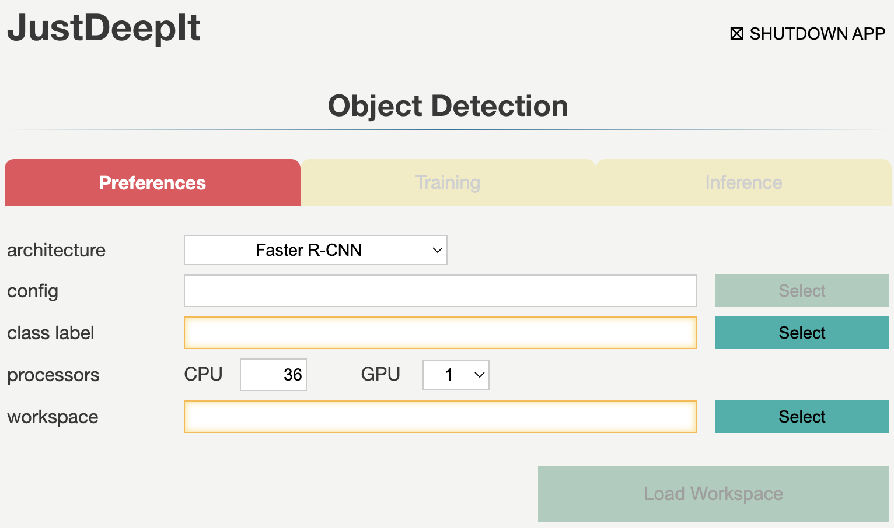
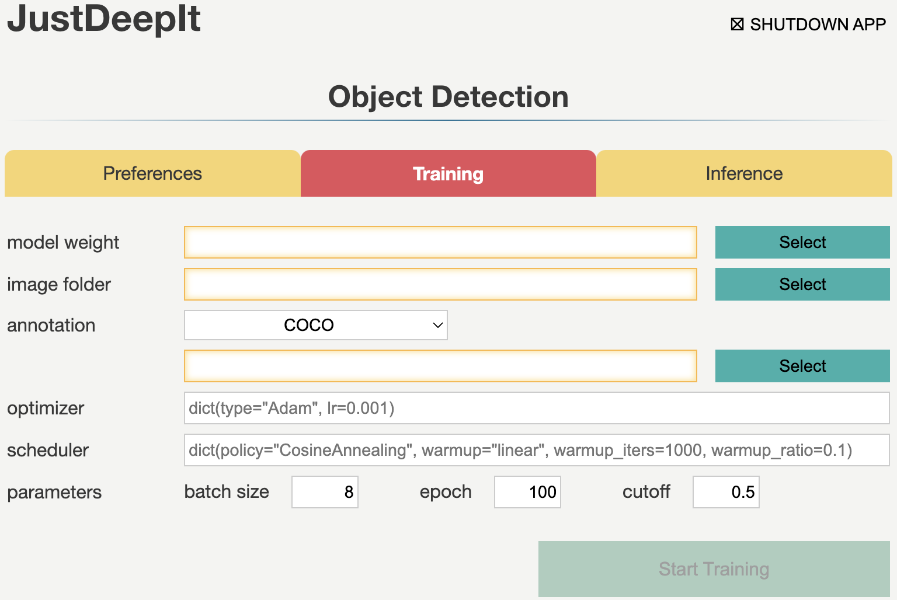
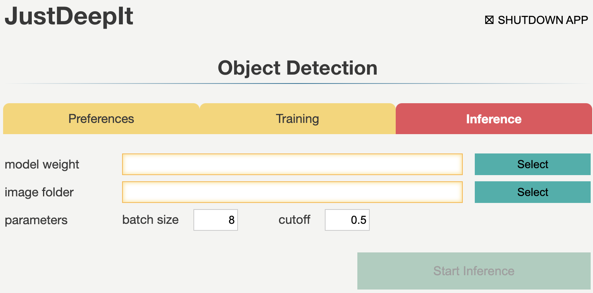

================
Object Detection
================

Object detection combines classification and localization
to identify objects in an image and specify their locations through bounding boxes.
JustDeepIt supports multiple well-known deep neural network architectures,
such as Faster R-CNN\ [#fasterrcnn]_,
YOLOv3\ [#yolov3]_,
SSD\ [#ssd]_,
RetinaNet\ [#retinanet]_,
and FCOS\ [#fcos]_,
to build object detection models for training and inference.
The inference results can be stored as
images with bounding boxes or a JSON file in the COCO format.
The following image is an example of wheat head detection results
with Faster R-CNN using GWHD datasset\ [#gwhd]_.

.. image:: ../_static/tutorials_GWHD_inference_output.jpg
    :align: center

GUI
===

The GUI window for object detection consists of three tabs:
**Preferences**, **Training**, and **Inference**.
These tabs are used for setting common parameters,
training models,
and inference (i.e., detecting objects) from the test
images using the trained model, respectively.
Tabs **Training** and **Inference** are disabled
until the settings in tab **Preferences** are defined.

Preferences
-----------

Tab **Preferences** is used for setting common parameters,
such as the architecture of the detection model,
number of CPUs and GPUs to be used,
and the location (i.e., directory path) to the workspace
which is used to save intermediate and final results.
The required fields are highlighted with orange borders.
Detailed descriptions of the arguments are provided in the following table.

.. csv-table::
    :header: "Argument", "Description"
    
    "**backend**", "The backend to build an object detection model.
    The current version of JustDeepIt supports MMDetection and Detectron2 as a backend."
    "**architecture**", "Architecture of object detection model."
    "**config**", "A path to a configuration file of MMDetection or Detectron2.
    If the path is not given, then use the default configuration file defined in JustDeepIt."
    "**class label**", "A path to a text file which contains class labels.
    The file should be multiple rows with one column,
    and string in each row represents a class label
    (e.g., `class_label.txt <https://github.com/biunit/JustDeepIt/blob/main/tutorials/OD/data/class_label.txt>`_)."
    "**CPU**", "Number of CPUs."
    "**GPU**", "Number of GPUs."
    "**workspace**", "Workspace to store intermediate and final results."
    

Training
--------

Tab **Training** is used to train the model for object detection.
It allows users to set general parameters of training,
such as the learning rate, batch size, and number of epochs.
Detailed descriptions of the arguments are provided in the following table.

.. csv-table::
    :header: "Argument", "Description"
    
    "**model weight**", "A path to store the model weight.
    If the file is exists, then resume training from the given weight."
    "**image folder**", "A path to a folder which contains training images."
    "**annotation format**", "Annotation format. COCO or Pascal VOC are supported."
    "**annotation**", "A path to a file (COCO format) or folder (Pascal VOC format)."
    "**batch size**", "Batch size."
    "**learning rate**", "Initial learning rate."
    "**epochs**", "Number of epochs."
    "**cutoff**", "Cutoff of confidence score for training."

Inference
---------

Tab **Inference** is used for detecting objects from test images using the trained model.
It allows users to set the confidence score of object detection results and batch size.

.. csv-table::
    :header: "Argument", "Description"
    
    "**model weight**", "A path to a trained model weight."
    "**image folder**", "A path to a folder contained test images."
    "**batch size**", "Batch size."
    "**cutoff**", "Cutoff of confidence score for inference (i.e., object detection)."
    

CUI
===

JustDeepIt implements three simple methods,
:meth:`train <justdeepit.models.OD.train>`,
:meth:`save <justdeepit.models.OD.save>`,
and :meth:`inference <justdeepit.models.OD.inference>`.
:meth:`train <justdeepit.models.OD.train>` is used for training the models,
while :meth:`save <justdeepit.models.OD.save>` is used for saving the trained weight,
and :meth:`inference <justdeepit.models.OD.inference>` is used for detecting objects in test images.
Detailed descriptions of these functions are provided below.

Architectures
-------------

A neural network architecture for object detection
can be initialized with class :class:`justdeepit.models.OD <justdeepit.models.OD>`.
For example, Faster R-CNN can be initialized by executing the following code.

.. code-block:: py

    from justdeepit.models import OD

    model = OD('./class_label.txt', model_arch='fasterrcnn')

To initialize Faster R-CNN with the pre-trained weight
(e.g. the weight pre-trained with COCO dataset),
the argument ``model_weight`` can be used.
Note that, the weight file (:file:`.pth`) pre-trained with COCO dataset
can be downloaded from the GitHub repositories of
`MMDetection <https://github.com/open-mmlab/mmdetection/tree/master/configs>`_
or `Detectron2 <https://github.com/facebookresearch/detectron2/tree/main/configs>`_.

.. code-block:: py

    from justdeepit.models import OD

    weight_fpath = '/path/to/pretrained_weight.pth'
    model = OD('./class_label.txt', model_arch='fasterrcnn', model_weight=weight_fpath)

To specify a backend for initializing an architecture,
the argument ``backend`` can be used.
MMDetection (``mmdetection``) or Detectron2 (``detectron2``)
can be used as the backend.

.. code-block:: py

    from justdeepit.models import OD

    model = OD('./class_label.txt', model_arch='fasterrcnn', backend='detectron2')

Currently, MMDetection requires GPU computational environment for model training
and supports more architectures
(e.g, Faster R-CNN, SSD, RetinaNet, FCOS, and YOLOv3)
than Detectron2 (e.g., Faster R-CNN and RetinaNet),
but the latter supports both CPUs and GPUs for model training.
The available architectures for object detection
can be checked by executing the following code.

.. code-block:: py

    from justdeepit.models import OD
    model = OD()
    print(model.available_architectures)

Training
--------

Method :meth:`train <justdeepit.models.OD.train>` is used for the model training
and requires at least two arguments
to specify the annotations and folder containing the training images.
Annotations can be specified in a single file in the COCO format
or a folder containing multiple files in the Pascal VOC format.
Training process requires a GPU environment if MMDetection is chosen as the backend
because it only supports GPU training.
Refer to the API documentation of :meth:`train <justdeepit.models.OD.train>`
for detailed usage.

.. code-block:: py

    from justdeepit.models import OD

    coco_fmt = '/path/to/coco/annotation.json'
    train_images_dpath = '/path/to/folder/images'

    model = OD('./class_label.txt', model_arch='fasterrcnn')
    model.train(coco_fmt, train_images_dpath)

The trained weight can be saved using method :meth:`save <justdeepit.models.OD.save>`,
which simultaneously stores the trained weight (extension :file:`.pth`)
and model configuration file (extensions :file:`.py` for MMDetection backend and :file:`.yaml` for Detectron2 backend).
Users can apply the weight and configuration file as needed
for generating a model using the MMDetection or Detectron2 library directly.
Refer to the API documentation of :meth:`save <justdeepit.models.OD.save>`
for detailed usage.

.. code-block:: py

    model.save('trained_weight.pth')

Inference
---------

Method :meth:`inference <justdeepit.models.OD.inference>`
is used to detect objects in the test images using the trained model.
This method requires at least one argument to specify a single image,
list of images, or a folder containing multiple images.
The detection results are returned as
a class object of :class:`justdeepit.utils.ImageAnnotations <justdeepit.utils.ImageAnnotations>`,
which is a list of class objects of :class:`justdeepit.utils.ImageAnnotation <justdeepit.utils.ImageAnnotation>`.

To save the results in the COCO format,
we can use method :meth:`format <justdeepit.utils.ImageAnnotations.format>`
implemented in class :class:`justdeepit.utils.ImageAnnotations <justdeepit.utils.ImageAnnotations>`
to generate a JSON file in the COCO format.

.. code-block:: py

    from justdeepit.models import OD

    test_images = ['sample1.jpg', 'sample2.jpg', 'sample3.jpg']

    model = OD('./class_label.txt', model_arch='fasterrcnn', model_weight='trained_weight.pth')
    outputs = model.inference(test_images)

    outputs.format('coco', './predicted_outputs.coco.json')

To save the detection results as images, for example,
showing the detected bounding boxes on the images, method :meth:`draw <justdeepit.utils.ImageAnnotation.draw>`
implemented in class :class:`justdeepit.utils.ImageAnnotation <justdeepit.utils.ImageAnnotation>` can be used.

.. code-block:: py
    
    for output in outputs:
        output.draw('bbox', os.path.join('./predicted_outputs', os.path.basename(output.image_path)))

Refer to the corresponding API documentation of
:meth:`inference <justdeepit.models.OD.inference>`,
:meth:`format <justdeepit.utils.ImageAnnotations.format>`, and
:meth:`draw <justdeepit.utils.ImageAnnotation.draw>`,
for the detailed usage.

References
===========

.. [#fasterrcnn] Ren S, He K, Girshick R, Sun J. Faster R-CNN: Towards Real-Time Object Detection with Region Proposal Networks. https://arxiv.org/abs/1506.01497
.. [#yolov3] Redmon J, Farhadi A. YOLOv3: An Incremental Improvement. https://arxiv.org/abs/1804.02767
.. [#ssd] Liu W, Anguelov D, Erhan D, Szegedy C, Reed S, Fu C, Berg AC. SSD: Single Shot MultiBox Detector. https://arxiv.org/abs/1512.02325
.. [#retinanet] Lin T, Goyal P, Girshick R, He K, Dollár P. Focal Loss for Dense Object Detection. https://arxiv.org/abs/1708.02002
.. [#fcos] Tian Z, Shen C, Chen H, He T. FCOS: Fully Convolutional One-Stage Object Detection. https://arxiv.org/abs/1904.01355
.. [#gwhd] David E, Madec S, Sadeghi-Tehran P, Aasen H, Zheng B, Liu S, Kirchgessner N, Ishikawa G, Nagasawa K, Badhon M A, Pozniak C, Solan B, Hund A, Chapman S C, Baret F, Stavness I, Guo W. Global Wheat Head Detection (GWHD) Dataset: A Large and Diverse Dataset of High-Resolution RGB-Labelled Images to Develop and Benchmark Wheat Head Detection Methods. https://doi.org/10.34133/2020/3521852

