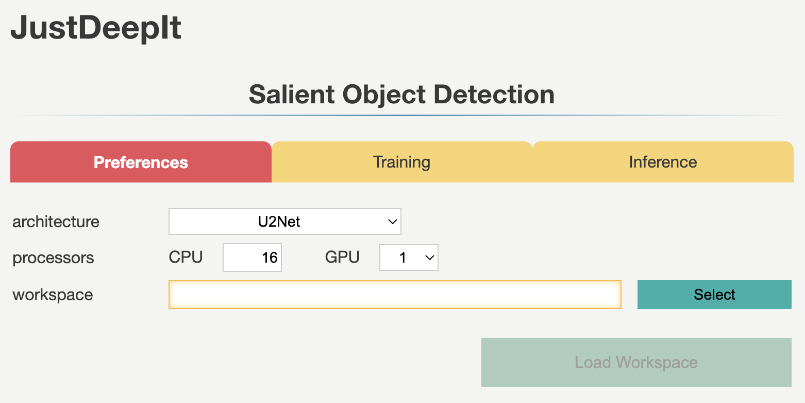
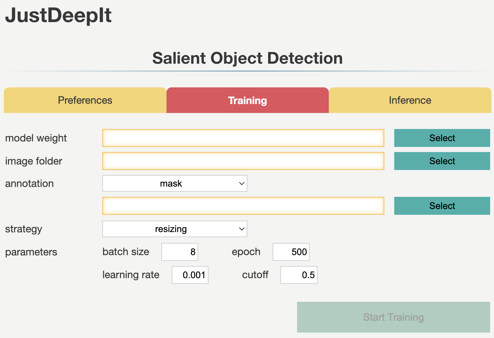
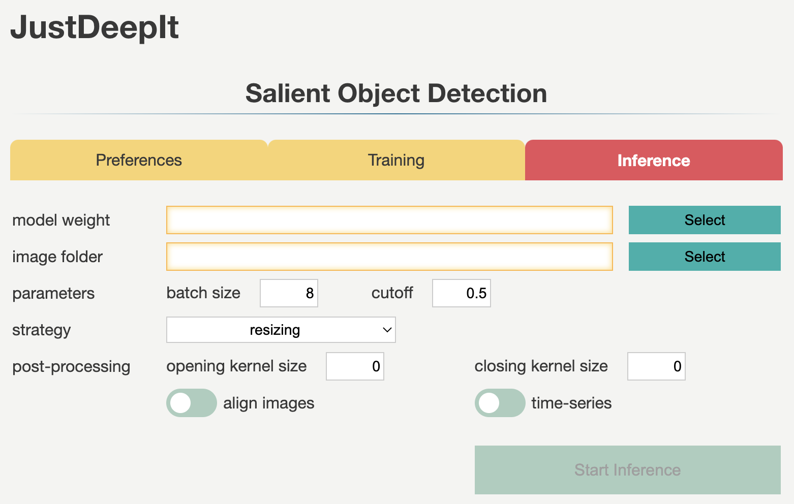
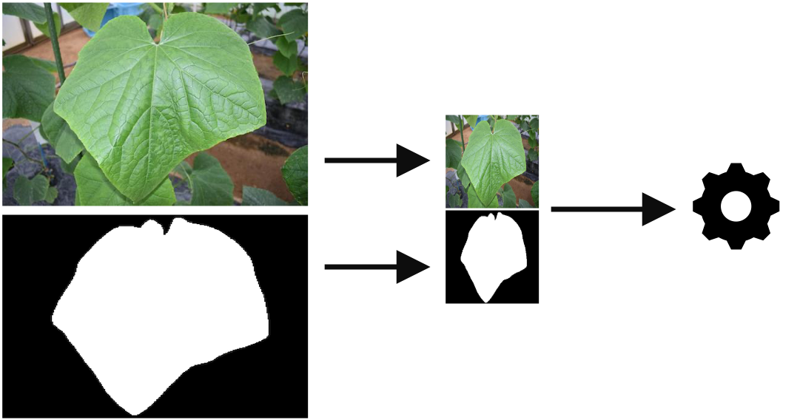
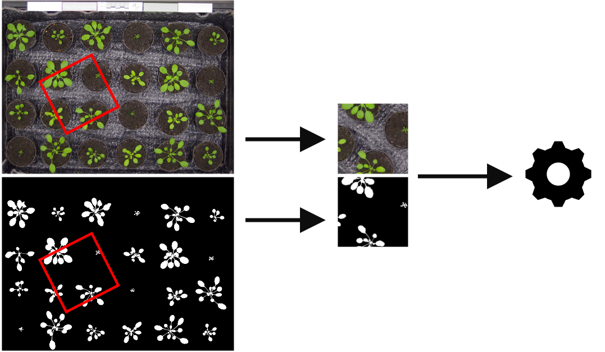
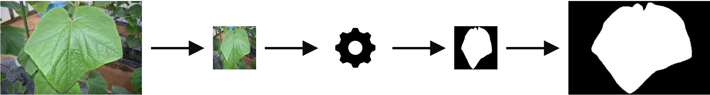
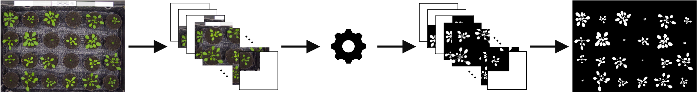

========================
Salient Object Detection
========================

Salient object detection is typically used to identify the main object in an image,
and it can be applied to one-class object segmentation tasks such as background removal,
leaf segmentation, root segmentation, and tumor segmentation.

GUI
===

The GUI window for salient object detection consists of three tabs:
**Preferences**, **Training**, and **Inference**.
These tabs are used for setting common parameters,
training models, and detecting objects from the test images using the trained model, respectively.
Tabs **Training** and **Inference** are disabled
until the settings in tab **Preferences** are defined.

Preferences
-----------

Tab **Preferences** is used for setting common parameters,
such as the architecture of the detection model,
number of CPUs and GPUs to be used,
and the location (directory path) to the workspace.
The workspace is used to save intermediate and final results.
Detailed descriptions of the arguments are provided in the following table.

.. csv-table::
    :header: "Argument", "Description"
    
    "**architecture**", "Architecture for salient object detection."
    "**CPU**", "Number of CPUs."
    "**GPU**", "Number of GPUs."
    "**workspace**", "Workspace to store intermediate and final results."

Training
--------

Tab **Training** is used to train the model for salient object detection.
It allows users to set general parameters of training,
such as the learning rate, batch size, and number of epochs.
Detailed descriptions of the arguments are provided in the following table.

.. csv-table::
    :header: "Argument", "Description"

    "**model weight**", "A path to store the model weight.
    If the file is exists, then resume training from the given weight."
    "**image folder**", "A path to an folder which contains training images."
    "**image suffix**", "A string of suffix of training images."
    "**mask suffix**", "A string of suffix of mask (ground truth) images."
    "**batch size**", "Batch size."
    "**epochs**", "Number of epochs."
    "**strategy**", "A training strategy. ``resizing`` or ``randomcrop`` can be selected."
    "**cropping size**", "An integer of cropping size for ``randomcrop`` strategy."

Inference
---------

Tab **Inference** is used for segment objects from test images using the trained model.
It also allows the user to set the confidence score of salient object detection results and batch size.
Detailed descriptions of the arguments are provided in the following table.

.. csv-table::
    :header: "Argument", "Description"

    "**model weight**", "A path to model weight."
    "**image folder**", "A path to an image or a folder contained multiple images
    targeted to salient object detection."
    "**batch size**", "Batch size."
    "**cutoff**", "Cutoff of confidence score for inference."
    "**strategy**", "A training strategy. ``resizing`` or ``sliding`` can be selected."
    "**cropping size**", "An integer of cropping size for ``sliding`` strategy."
    "**time-series**", "If the input images are taken with a fixed camera in time-series, turning on this option will give object ID by considering the time-series."
    "**align image**", "Turning on this option, JustDeepIt will align all images by position before any post-processings."
    "**image opening kernel size**", "Kernel size for image opening process which is used for remove small white spots (e.g. noise, very small objects, etc)."
    "**image closing kernel size**", "Kernel size for image closing process which is used for remove small black spots (e.g. a small hole in the object area)."

CUI
===

JustDeepIt implements three simple methods,
:func:`train <justdeepit.models.SOD.train>`,
:func:`save <justdeepit.models.SOD.save>`,
and :func:`inference <justdeepit.models.SOD.inference>`.
:func:`train <justdeepit.models.SOD.train>` is used for training the models,
while :func:`save <justdeepit.models.SOD.save>` is used for saving the training weights,
and :func:`inference <justdeepit.models.SOD.inference>` is used for detecting objects in test images.
Detailed descriptions of these functions are provided below.

Model Trainig
--------------

Method :func:`train <justdeepit.models.SOD.train>` is used for the model training
and requires at least one argument to specify a file which contains training images and mask images.
The file should be a tab-separeted file which contains the two columns.
On each line, the first column records a path to a training image,
and the second column records a path to the corresponding mask image.
To check the detailed usage of method :func:`train <justdeepit.models.SOD.train>` and all its arguments,
refer to the corresponding API documentation.

.. code-block:: python

    from justdeepit.models import SOD
    
    ## train_images.txt
    ## ----------------
    ## train_image_01.jpg   train_mask_01.png
    ## train_image_02.jpg   train_mask_02.png
    ##       :                    :
    
    model = SOD()
    model.train('train_images.txt')

The training weights can be saved using method :func:`save <justdeepit.models.SOD.save>`,
which stores the trained weights.

.. code-block:: python

   model.save('final_weight.pth')

Inference
----------

Method :func:`inference <justdeepit.models.SOD.inference>`
is used to perform salient object detect from the test images using the trained model.
This method requires at least one argument to specify a single image,
list of images, or folder containing multiple images.

.. code-block:: python

    import skimage.io
    from justdeepit.models import SOD
    
    test_images = ['sample1.jpg', 'sample2.jpg', 'sample3.jpg']
    
    model = justdeepit.models.SOD('final_weight.pth')
    outputs = model.inference(test_images)

To show the detection results as images, for example,
showing the detected contours on the images,
method :func:`draw <justdeepit.utils.ImageAnnotation.draw>`
implemented in class :class:`justdeepit.utils.ImageAnnotation` can be used.
Here is an example to show the detection result of the first image.

.. code-block:: python
    
    im0 = outputs[0].draw('contour')
    skimage.io.imshow(im0)

To save the detection results as images,
specify the path to the method :func:`draw <justdeepit.utils.ImageAnnotation.draw>`.
Here is an example to save the detection results of all test images.

.. code-block:: python

    for test_image, output in zip(test_images, outputs):
        mask_fpath = os.path.splitext(test_image) + '_mask.png'
        output.draw('mask', mask_fpath)

    
    

To check the detailed usage of method :func:`inference <justdeepit.models.SOD.inference>` and all its arguments,
refer to the corresponding documentation.
For usage details of method :func:`draw <justdeepit.utils.ImageAnnotation.draw>`,
refer to the documentation of class :class:`justdeepit.utils.ImageAnnotation`.

Training Strategy
=================

As the U\ :sup:`2`-Net implementation in JustDeepIt requires images of 288 x 288 pixels,
JustDeepIt uses *resizing* or *random cropping* to handle training images of various sizes.
*resizing* scales the training images and annotations (i.e., masks) to 288 x 288 pixels
for U\ :sup:`2`-Net training.
This approach is used to process images containing one or few large objects. 

*random cropping* randomly extracts small areas of p x p pixels from the original images
and annotations with a random angle.
The areas of *p* x *p* pixels are then resized to 288 x 288 pixels for U\ :sup:`2`-Net training.
*p* can be specified by the user based on the complexity of the target images and tasks.
This approach is used to treat images containing several small objects and details.

Detection Strategy
==================

Similar to training,
two approaches can be adopted for salient object detection: *resizing* and *sliding*.
*resizing* is similar to the corresponding training approach.
Hence, the input image is resized to 288 x 288 pixels to perform detection,
and the original size is restored after detection.
If the model is trained using *resizing*, *resizing* approach should be set for detection.

*sliding* crops square areas of *p* x *p* pixels from the input image
from the top left to the bottom right of the image and resizes the areas to 288 x 288 pixels.
Next, salient object detection is performed on the resized square areas.
After all the areas are processed, their results are combined into a single image.
This approach corresponds to random cropping during training.
Thus, if the model is trained using *random cropping*, *sliding* should be used for detection.

