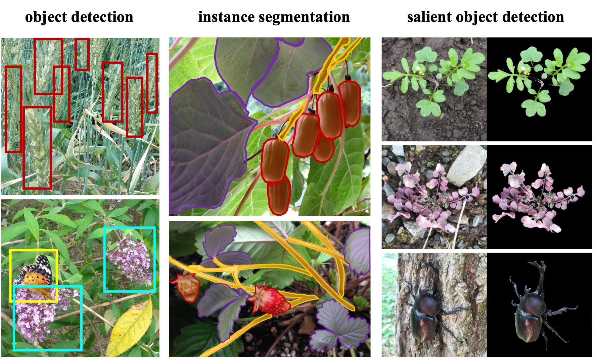

.. JustDeepIt documentation master file

JustDeepIt
==========

.. toctree::
    :maxdepth: 2
    :hidden:
    
    installation
    implementation
    quickstart
    tutorials
    api 
    

Image analysis based on deep learning
are becoming mainstream and increasingly accessible
for solving various scientific problems in diverse fields including plant science.
Practical applications in plant science include
species classification,
fruit detection,
plant disease and pest detection,
weed detection,
leaf segmentation,
and plant segmentation.
Python programming language ant its libraries including
`PyTorch <https://pytorch.org/>`_,
`MMDetection <https://mmdetection.readthedocs.io/>`_,
and `Detectron2 <https://detectron2.readthedocs.io/>`_
have made deep learning much easier and more accessible to researchers.
However, deep learning technologies remain challenging
for programming beginners
because they require computer programming skills 
and a basic familiarity with character user interfaces (CUIs).
JustDeepIt aims to
simplify object detection, instance segmentation,
and salient object detection using deep learning
by providing graphical user interface (GUI).
In addition, to ensure flexibility and extensibility,
JustDeepIt also provides CUI.
It may be applicable for image analysis in various disciplines beyond plant science.

