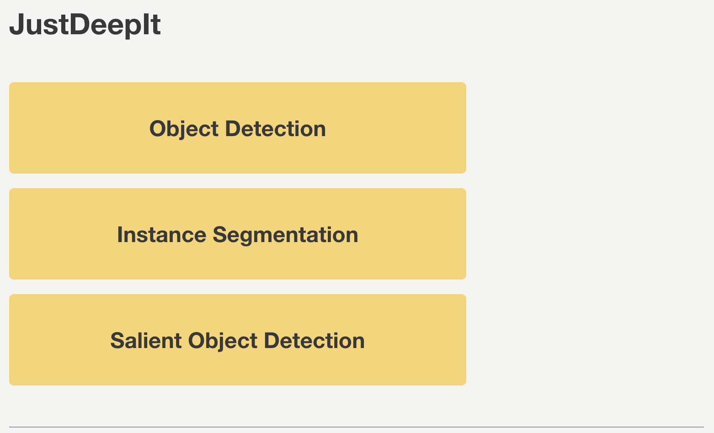
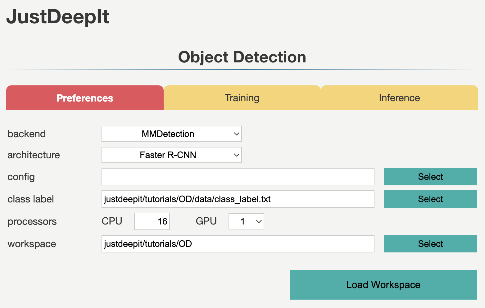
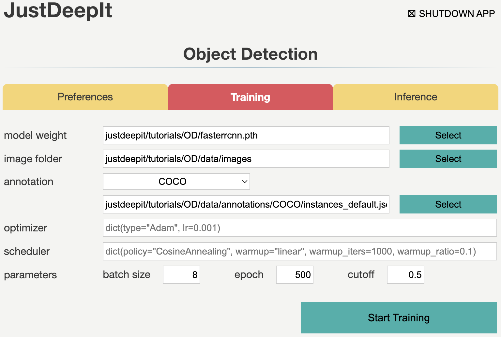
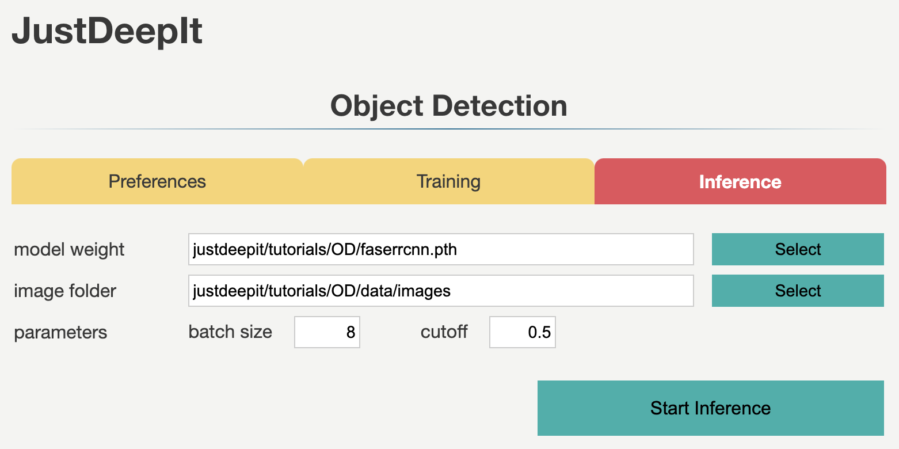
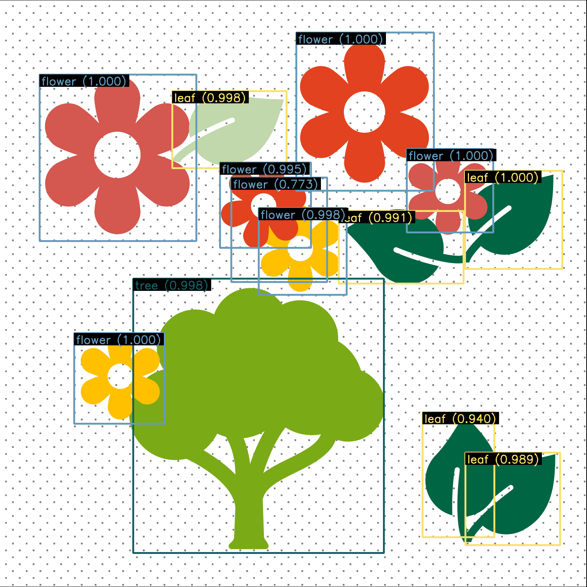

.. _quickstart-OD:

================
Object detection
================

JustDeepIt supports object detection, instance segmentation,
and salient object detection using GUI or CUI.
In this tutorial, to overview the functions for object detection,
we demonstrate how to use JustDeepIt for object detection, using an artificial dataset.

Dataset
=======

The artificial dataset used for this quick start is stored in
GitHub (`JustDeepIt/tutorials/OD <https://github.com/biunit/JustDeepIt/tree/main/tutorials/OD>`_).
The :file:`data` folder contains :file:`images` folder,
:file:`annotations` folder, and :file:`class_labels.txt` file.
The :file:`images` folder contains training images.
The :file:`annotations` folder contains annotation of training images.
:file:`class_labels.txt` is an text file containing the class labels of training images.
Users can use :code:`git` command to download the dataset from GitHub with the following script.

.. code-block:: sh
    
    git clone https://github.com/biunit/JustDeepIt
    
    ls JustDeepIt/tutorials/OD
    # data run_fasterrcnn.py
    
    ls JustDeepIt/tutorials/OD/data
    # annotations     class_label.txt images
    
    ls JustDeepIt/tutorials/OD/data/images
    # e1.png  e10.png e2.png  e3.png  e4.png  e5.png  e6.png  e7.png  e8.png  e9.png
    

Settings
========

To start JustDeepIt, we open the terminal,
as the following commands,
change the current directory to :file:`JustDeepIt/tutorials/OD`,
and run :code:`justdeepit` command.

.. code-block:: sh
    
    cd JustDeepIt/tutorials/OD
    
    justdeepit
    # INFO:uvicorn.error:Started server process [61]
    # INFO:uvicorn.error:Waiting for application startup.
    # INFO:uvicorn.error:Application startup complete.
    # INFO:uvicorn.error:Uvicorn running on http://127.0.0.1:8000 (Press CTRL+C to quit)

Then, we open the web browser and accesss to \http://127.0.0.1:8000.
At the startup screen, we press "Object Detection" button to start object detection mode.

Next, at the **Preferences** screen,
we set the **architecture** to Faster R-CNN,
and the other parameters as shown in the screenshot below.
The **workspace** will be automatically set as the path of the current folder
(e.g., :file:`JustDeepIt/tutorials/OD`, depending on the user's environment).
Then, we press button **Load Workspace**.

Once the **Preferences** is set,
the functions of **Training** and **Inference** become available.

.. _quickstart-OD-training:

Training
========

To train the model,
we select tab **Training**
and specify the **model weight** as the location storing the training weights,
**image folder** as the folder containing training images (i.e., :file:`images`),
**annotation** format as the format of the annotation file (COCO in this case),
**annotation** as the file of image annotations (i.e., :file:`instances_default.json`),
and other parameters as shown in screenshot below.
Note that the values of **model weight**, **image folder**, and **annotation** may be
different from the screenshot depending on user's environment.
We then press the button **Start Training** for model training.

Training takes 3-4 hours, depending on the computer hardware.

.. _quickstart-OD-inference:

Inference
=========

In tab **Inference**, the **model weight** is specified to the trained weights,
whose file extension is :file:`.pth` in general.
We specify **image folder** to the folder containing the images for inference
(to simplify, here we use the training images)
and other parameters as shown in screenshot below.
Note that the values of **model weight** and **image folder** may be
different from the screenshot depending on user's environment.
We then press the button **Start Inference** for inference.

The inference results will be stored in folder :file:`justdeepitws/outputs` of the workspace
as images with bounding boxes and a JSON file in COCO format (:file:`annotation.json`).
Examples of inference results are shown in the figure below.

API
====

Training and inference can be performed using the JustDeepIt API.
Python script :file:`run_justdeepit.py` stored in GitHub
(`JustDeepIt/tutorials/OD <https://github.com/biunit/JustDeepIt/tree/main/tutorials/OD>`_)
can be used for this purpose.

.. code-block:: sh
    
    cd JustDeepIt/tutorials/OD
    
    python run_justdeepit.py

