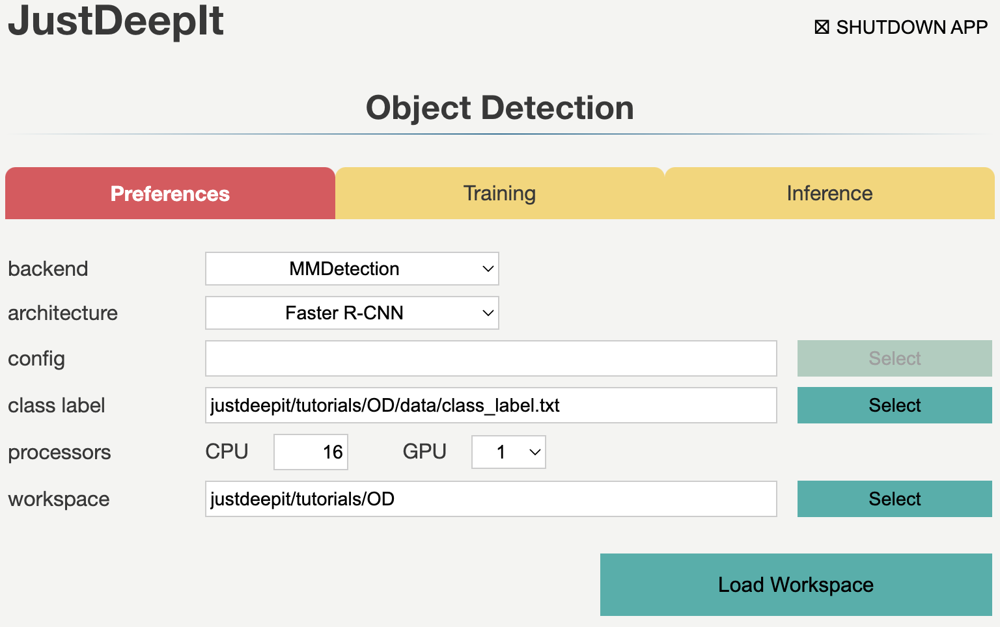
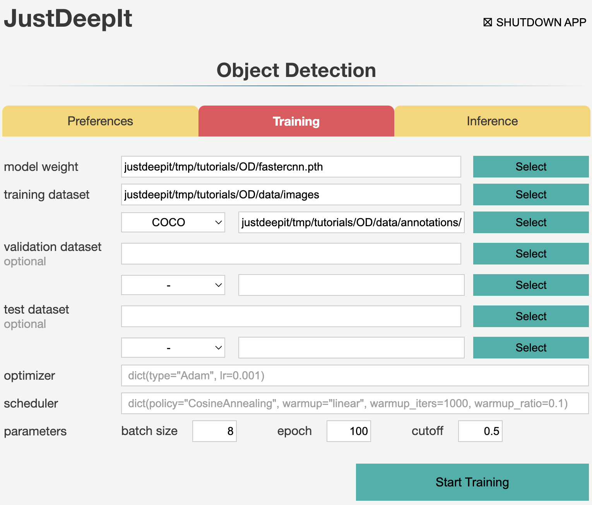
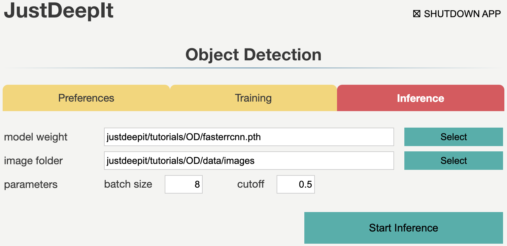
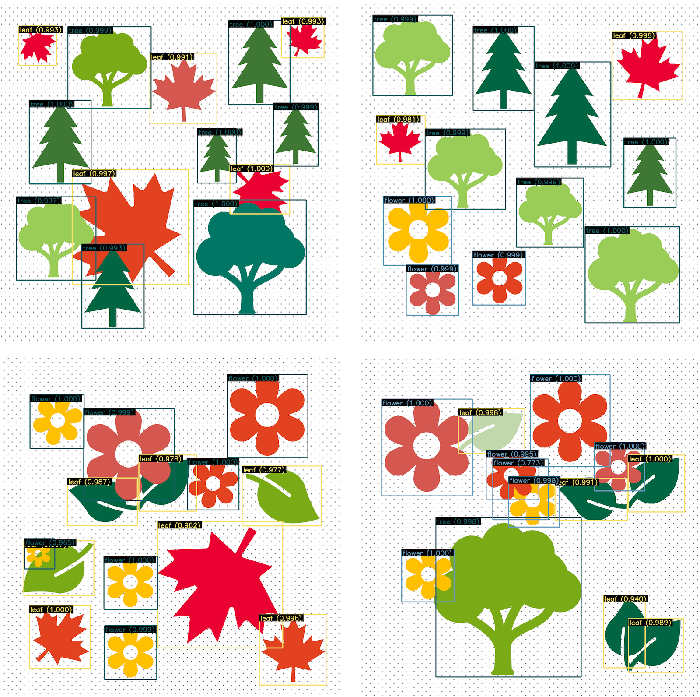

================
Object Detection
================

JustDeepIt supports object detection, instance segmentation,
and salient object detection using GUI or CUI.
In this tutorial, to overview the functions for object detection,
we demonstrate how to use JustDeepIt for object detection, using an artificial dataset.

Dataset
=======

The artificial dataset used for this quick start guide is stored in
GitHub (`JustDeepIt/tutorials/OD <https://github.com/biunit/JustDeepIt/tutorials/OD>`_).
The :file:`data` folder contains :file:`images` folder,
:file:`annotations` folder, and :file:`class_labels.txt` file.
The :file:`images` folder contains training images.
The :file:`annotations` folder contains annotation of training images.
:file:`class_labels.txt` is an text file containing the class labels of training images.
One can use :code:`git` command to download dataset from GitHub with the following script.

.. code-block:: sh
    
    git clone https://github.com/biunit/JustDeepIt
    
    ls JustDeepIt/tutorials/OD
    # data run_fasterrcnn.py
    
    ls JustDeepIt/tutorials/OD/data
    # annotations     class_label.txt images

Settings
========

To start JustDeepIt, we open the terminal,
change the current directory to :file:`JustDeepIt/tutorials/OD`,
and run the following command.

.. code-block:: sh
    
    cd JustDeepIt/tutorials/OD
    
    justdeepit
    # INFO:uvicorn.error:Started server process [61]
    # INFO:uvicorn.error:Waiting for application startup.
    # INFO:uvicorn.error:Application startup complete.
    # INFO:uvicorn.error:Uvicorn running on http://0.0.0.0:8000 (Press CTRL+C to quit)

Then, we open the web browser and accesss to \http://0.0.0.0:8000.
At the startup screen, we press "Object Detection" button to start object detection mode.

.. image:: ../_static/app_main.png
    :width: 70%
    :align: center

Next, at the **Preferences** screen,
we set the **architecture** to Faster R-CNN,
and the other parameters as shown in the screenshot below.
The **workspace** will be automatically set as :file:`JustDeepIt/tutorials/SOD`.
Then, we press button **Load Workspace**.
The **config** will be automatically set after loading workspace.

Once the workspace is set,
the functions of training and inference become available.

Training
========

To train the model,
we select tab **Training**
and specify the **model weight** as the location storing the training weights,
**image folder** as the folder containing training images (i.e., :file:`images`),
**annotation** format as the format of the annotation file (COCO in this case),
and **annotation** as the file of image annotations (i.e., :file:`instances_default.json`).
We then press the buttons **Start Training** for model training.

Training takes 3-4 hours, depending on the computer hardware.

Inference
=========

In tab **Inference**, the **model weight** is specified to the training weights,
whose file extension is :file:`.pth` in general.
We specify **image folder** to the folder containing the images
(to simplyfy, here we use training images) for inference,
and other parameters as shown in screenshot below.
We then press the buttons **Start Inference** for inference.

The inference results will be stored in folder :file:`justdeepitws/outputs` of the workspace
as images with bounding boxes and a JSON file in COCO format (:file:`annotation.json`).

Results
=======   

Examples of inference results are shown in the figure below.

API
====

Training and inference can be performed using the JustDeepIt API.
Python script :file:`run_fasterrcnn.py` stored in GitHub
(`JustDeepIt/tutorials/OD <https://github.com/biunit/JustDeepIt/tutorials/OD>`_)
can be used for this purpose.

