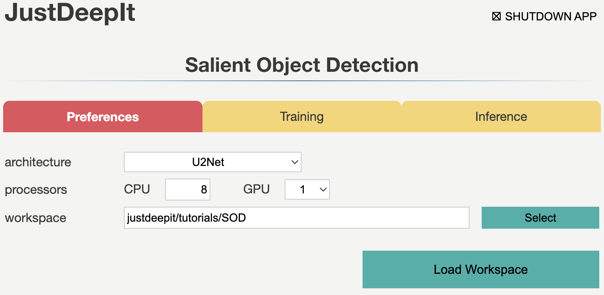
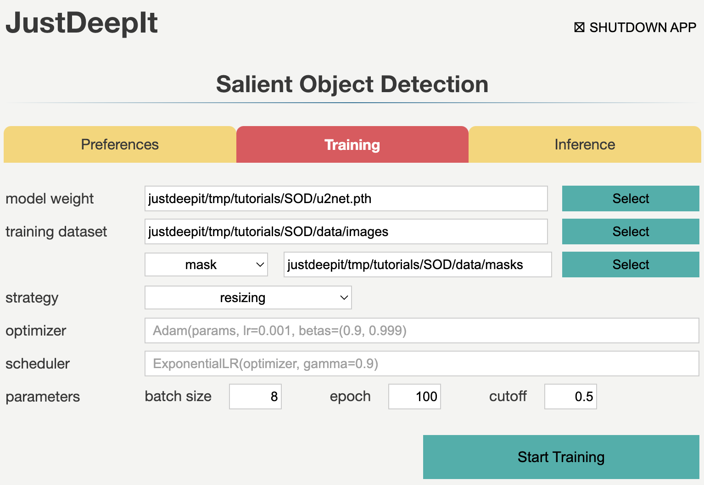

========================
Salient Object Detection
========================

JustDeepIt supports users to perform object detection, instance segmentation,
and salient object detection with GUI or CUI.
In this tutorial, to overview of functions for salient object detection,
we showed the usage of JustDeepIt for salient object detection with artificial dataset.

Dataset
=======

The artificial dataset used for this quick start guide is stored in
GitHub (`JustDeepIt/tutorials/SOD <https://github.com/biunit/JustDeepIt/tutorials/SOD>`_).
The :file:`data` folder contains :file:`train_images` and :file:`query_images` folders.
:file:`train_images` folder contains training images and mask images (annotation).
:file:`query_images` folder contains test images, actually these images are same as the images in :file:`train_images`.
One can use :code:`git` command to download dataset from GitHub with the following script.

.. code-block:: sh
    
    git clone https://github.com/biunit/JustDeepIt

    ls JustDeepIt/tutorials/SOD
    # data run_u2net.py

    ls JustDeepIt/tutorials/SOD/data
    # query_images train_images

Settings
========

To start JustDeepIt, we open the terminal,
change the current directory to :file:`JustDeepIt/tutorials/SOD`,
and run the following command.

.. code-block:: sh

    cd JustDeepIt/tutorials/SOD

    justdeepit
    # INFO:uvicorn.error:Started server process [61]
    # INFO:uvicorn.error:Waiting for application startup.
    # INFO:uvicorn.error:Application startup complete.
    # INFO:uvicorn.error:Uvicorn running on http://0.0.0.0:8000 (Press CTRL+C to quit)

Then, we open the web browser and accesss to \http://0.0.0.0:8000.
At the startup screen, we press "Salient Object Detection" button
to start salient object detection mode.

.. image:: ../_static/app_main.png
    :width: 70%
    :align: center

Next, at the **Preferences** screen,
we set parameters as shown in the screenshot below.
The **workspace** will be automatically set as :file:`JustDeepIt/tutorials/OD`.
Then, we press button **Load Workspace**.

Once the workspace is set,
the functions of training and inference become available.

Training
========

To train the model,
we select tab **Training**
and specify the **model weight** as the location storing the training weight
and **image folder** as the folder (i.e., :file:`data/train_images`)
containing training images and masks.
Next, we set the suffixes of the training images and mask
to ``_image.jpg`` and ``_mask.png``, respectively.
Then, we press buttons **Start Training** for model training.

Training takes 3-4 hours, and it depends on the computer hardware.

Inference
=========

In tab **Inference**, the model weight is specified to the training weights,
whose file extension is pth in general.
We specify **image folder** to the folder containing the images (e.g., :file:`data/query_images`) for inference.
Then, we press buttons **Start Inference** for inference.

.. image:: ../_static/quickstart_sod_eval.png
    :align: center

The inference results will be stored in folder :file:`justdeepitws/outputs` of the workspace.

Results
=======   

Examples of inference results are shown in the figure below.

API
====

Training and inference can be performed using the JustDeepIt API.
Python script :file:`run_u2net.py` stored in GitHub
(`JustDeepIt/tutorials/SOD <https://github.com/biunit/JustDeepIt/tutorials/SOD>`_)
can be used for this purpose.

