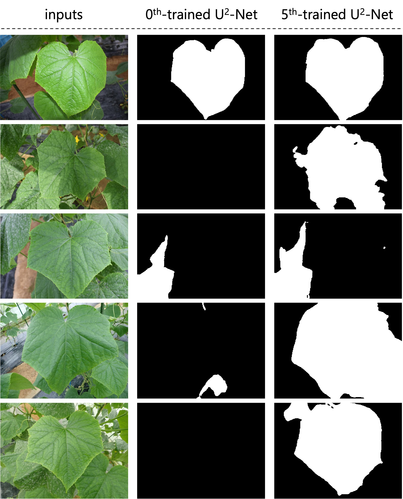

=================================
Leaf Extraction (U\ :sup:`2`-Net)
=================================

The background of an image can affect the performance of object classification and detection.
Thus, extracting a salient object by removing the background may improve the performance of these tasks.
However, training the model requires several annotated images.
Usually, annotation is costly and time-consuming.
In this tutorial, we illustrate the use of AgroLens
to train U\ :sup:`2`-Net\ [#u2net]_ for background removal from unannotated images.

Dataset Preparation
===================

The `AI Pest Image (AIPI) dataset <https://www.naro.affrc.go.jp/org/niaes/damage/>`_
contains images of over 400 thousands
cucumbers, eggplants, strawberries, and tomatoes labeled according to crop tissue and disease.
However, no annotations are available at the leaf level.
To simplify the tutorial, we only use the leaf tissue of cucumber
to train U\ :sup:`2`-Net for background removal, that is, extracting the leaf area.

Images of cucumber leaves can be downloaded manually or using wget commands.
There are 29,045 cucumber leaf images in the AIPI dataset.
We store the images in folder :file:`AIPI/data/images` to then use the AgroLens API
to train U2-Net for leaf extraction.

Model Training and Leaf Extraction
==================================

Training is performed as follow steps:

    1.	We download the weights of U\ :sup:`2`-Net (0\ :sup:`th`-trained U\ :sup:`2`-Net) pretrained on the DUTS dataset from the corresponding GitHub repository and used the 0\ :sup:`th`-trained U\ :sup:`2`-Net for leaf segmentation on the images in folder :file:`AIPI/data/images`.
    2.	After detection, we validate the results. The images in which the entire area is detected as a salient object (e.g., image 3) or no detection occurred (e.g., image 4) are discarded.
    3.	We use the remaining images and detection results (i.e., mask images) to train U\ :sup:`2`-Net.
    4.	We use the trained U\ :sup:`2`-Net from step 3 for salient object detection on the cucumber leaf images in folder :file:`AIPI/data/images`.
    5.	We repeat steps 2-4 to train U\ :sup:`2`-Net five times, finally obtaining the 5\ :sup:`th`-trained U\ :sup:`2`-Net.

As most steps are repeated five times,
we use the AgroLens API to efficiently repeat them automatically.
The executable Python scripts are available at
`GitHub:AgroLens/tutorials/AIPI/iterative_u2net.py <https://github.com/biunit/AgroLens>`_.

.. code-block:: sh
    
    git clone https://github.com/biunit/AgroLens
    cd AgroLens/tutorials/AIPI
    
    # donwload images and put them into AgroLens/tutorials/AIPI/data/images folder
    
    python scripts/iterative_u2net.py

Training in this case study takes 4.5 days, and it depends on the computer hardware.

The results of leaf segmentation will be stored in folder :file:`AIPI/data/images_5`
after running the corresponding Python script.   
 

   
Results
=======

Examples of detection results of the 0\ :sup:`th`- and 5\ :sup:`th`-trained U\ :sup:`2`-Net are shown in the figure below. 

References
==========

.. [#u2net] Qin X, Zhang Z, Huang C, Dehghan M, Zaiane O R, Jagersand M. U2-Net: Going Deeper with Nested U-Structure for Salient Object Detection. https://doi.org/10.1016/j.patcog.2020.107404

