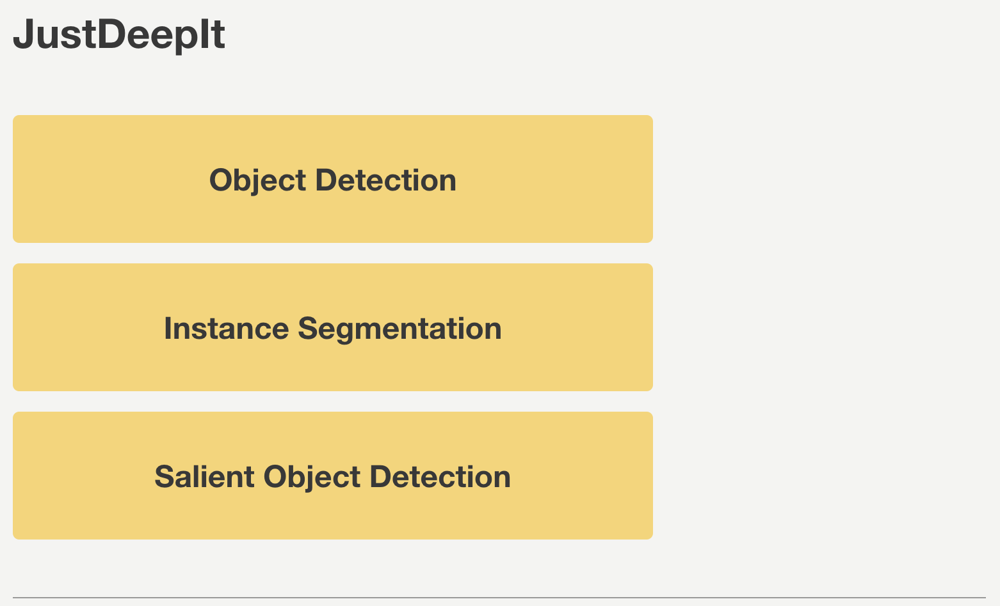

=============================================
Object detection with customized architecture
=============================================

In this tutorial,
we demonstrate how to use JustDeepIt for object detection
using a user customized neural network architecture.

Dataset
=======

The artificial dataset used for this quick start is stored in
GitHub (`JustDeepIt/tutorials/OD <https://github.com/biunit/JustDeepIt/tree/main/tutorials/OD>`_).
The :file:`data` folder contains :file:`images` folder,
:file:`annotations` folder, and :file:`class_labels.txt` file.
The :file:`images` folder contains training images.
The :file:`annotations` folder contains annotation of training images.
:file:`class_labels.txt` is an text file containing the class labels of training images.
Users can use :code:`git` command to download the dataset from GitHub with the following script.

.. code-block:: sh
    
    git clone https://github.com/biunit/JustDeepIt
    
    ls JustDeepIt/tutorials/OD
    # data run_fasterrcnn.py
    
    ls JustDeepIt/tutorials/OD/data
    # annotations     class_label.txt images
    
    ls JustDeepIt/tutorials/OD/data/images
    # e1.png  e10.png e2.png  e3.png  e4.png  e5.png  e6.png  e7.png  e8.png  e9.png
    

Settings
========

To start JustDeepIt, we open the terminal,
as the following commands,
change the current directory to :file:`JustDeepIt/tutorials/OD`,
and run :code:`justdeepit` command.

.. code-block:: sh
    
    cd JustDeepIt/tutorials/OD
    
    justdeepit
    # INFO:uvicorn.error:Started server process [61]
    # INFO:uvicorn.error:Waiting for application startup.
    # INFO:uvicorn.error:Application startup complete.
    # INFO:uvicorn.error:Uvicorn running on http://127.0.0.1:8000 (Press CTRL+C to quit)

Then, we open the web browser and accesss to \http://127.0.0.1:8000.
At the startup screen, we press "Object Detection" button to start object detection mode.

Next, at the **Preferences** screen,
we set the **architecture** to *custom*,
set **config** to *faster_rcnn_x101_64x4d_fpn_mstrain_3x_coco*,
and the other parameters as shown in the screenshot below.

The user can find the file to input the **config** argument from the configs directory of the
`MMDetection <https://github.com/open-mmlab/mmdetection/tree/master/configs/>`_
or
`Detectron2 <https://github.com/facebookresearch/detectron2/tree/main/configs>`_
GitHub repositories.
For example, the 
`faster_rcnn <https://github.com/open-mmlab/mmdetection/tree/master/configs/faster_rcnn>`_
of MMDetection repository contains many variants of Faster R-CNN, as follows:

- faster_rcnn_r50_fpn_mstrain_3x_coco.py
- faster_rcnn_r101_caffe_fpn_mstrain_3x_coco.py
- faster_rcnn_x101_32x8d_fpn_mstrain_3x_coco.py
- ...

We can choose one of them to set the **config** argument of JustDeepIt.
Note that when inputing the **config** argument,
the extension :file:`.py` can be omitted.
The screenshot above shows an example of setting
Faster R-CNN with ResNeXt backbone (*faster_rcnn_x101_32x8d_fpn_mstrain_3x_coco*)
for object detection.

Then, we press button **Load Workspace**.
Once the **Preferences** is set,
the functions of **Training** and **Inference** become available.

From here, the same procedure as in the :ref:`quick start of object detection <quickstart-OD>`
can be used for model training and inference.
Refer to :ref:`Training <quickstart-OD-training>`
and :ref:`Inference <quickstart-OD-inference>` in the quick start for details.

Training
========

See :ref:`Training <quickstart-OD-training>` in
the :ref:`the quick start of object detection <quickstart-OD>` for details.

Inference
=========

See :ref:`Inference <quickstart-OD-inference>` in
the :ref:`the quick start of object detection <quickstart-OD>` for details.

