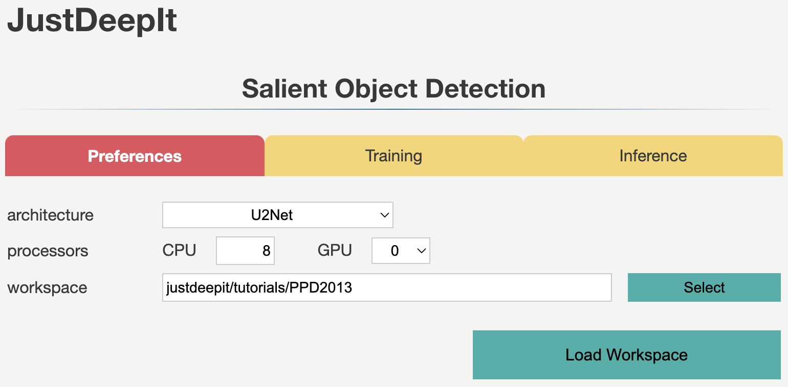
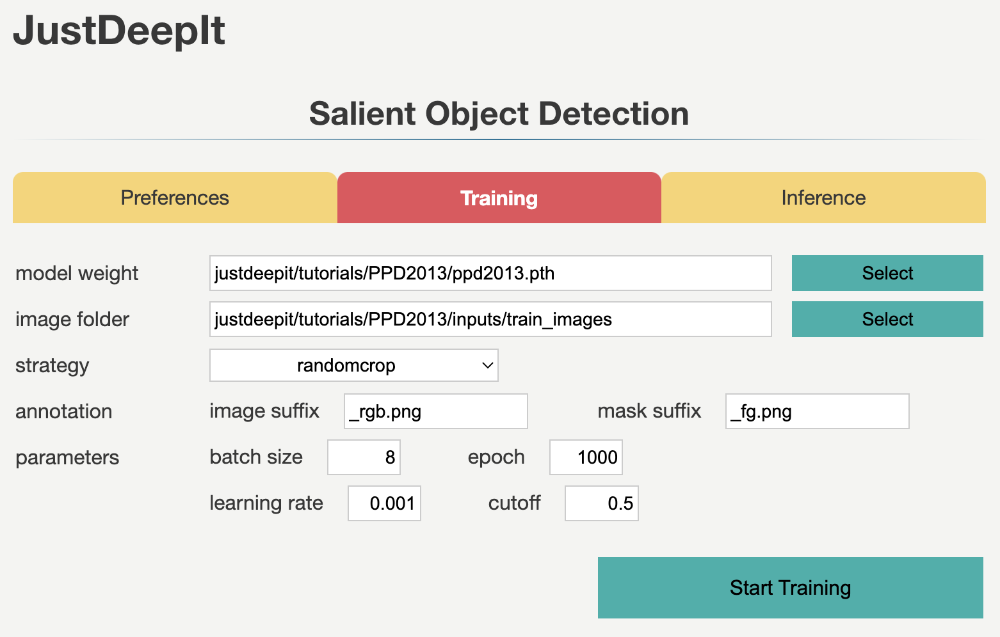
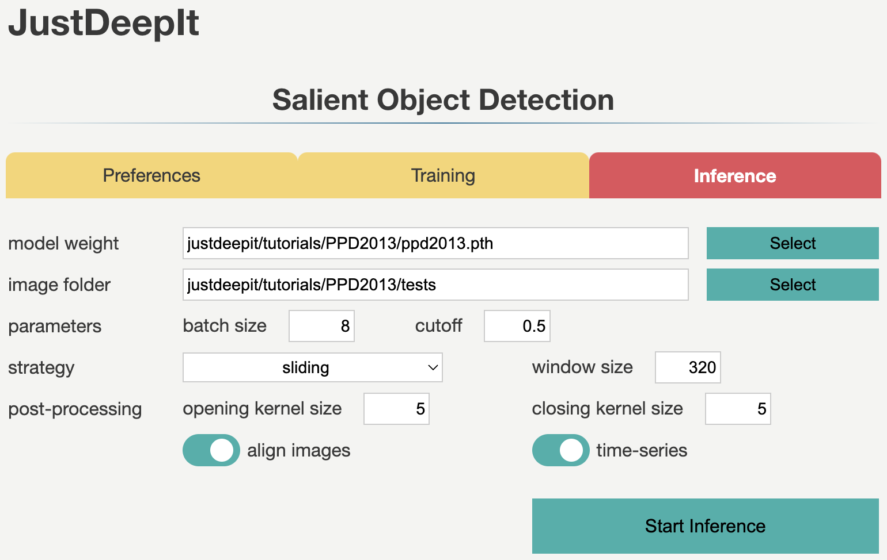
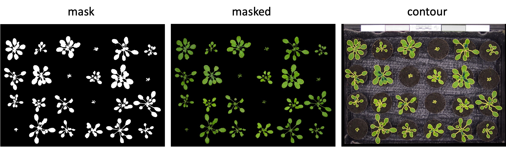
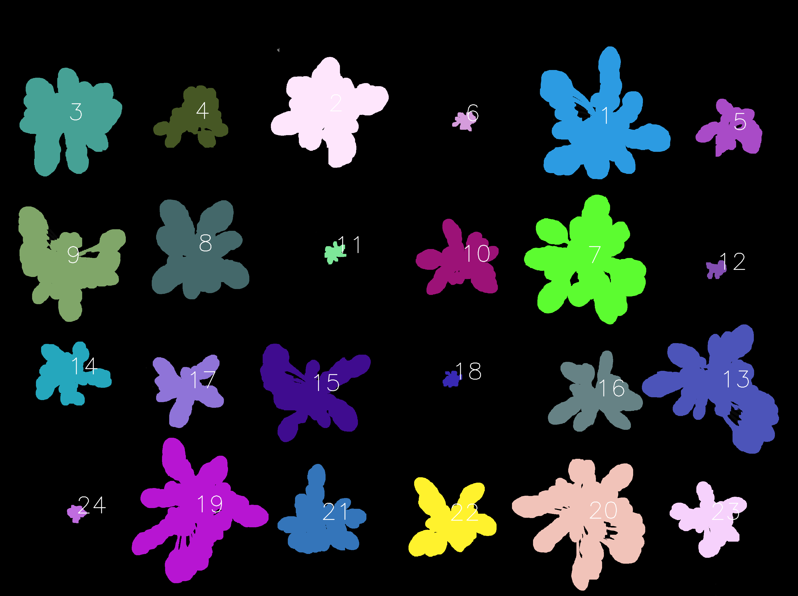
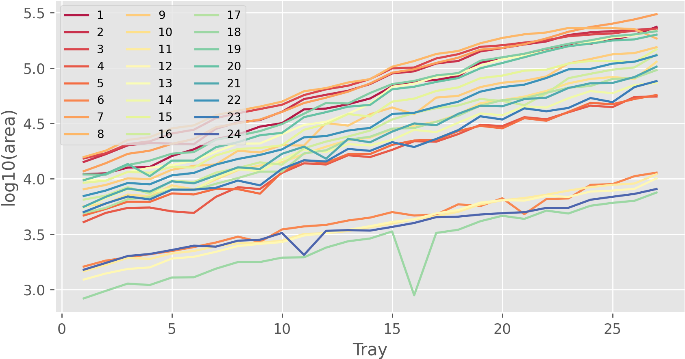
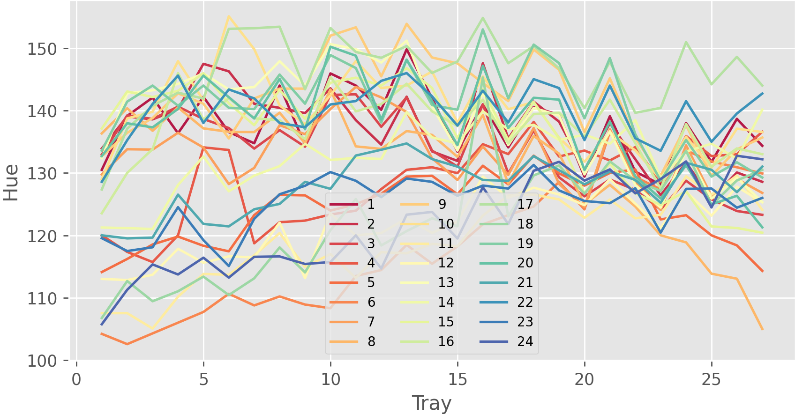

====================================
Plant Segmentation (U\ :sup:`2`-Net)
====================================

Phenotyping is important in plant biology as well as breeding and crop management.
It depends on leaf detection or leaf segmentation
because the leaf color can be used to estimate the nutritional state
while the area index can be used to measure plant growth and estimate the final yields.
In this tutorial, we illustrate the use of JustDeepIt
to train U2-Net\ [#u2net]_ and apply the trained model to leaf segmentation.

Dataset Preparation
===================

The dataset used in this case study can be downloaded from
Computer Vision Problems in `Plant Phenotyping—CVPPP <https://www.plant-phenotyping.org/CVPPP2017-challenge>`_.
The dataset is intended for developing and evaluating methods for plant detection,
localization, segmentation, and other tasks.
The original dataset is grouped into three levels: ray, stack, and plant.
Level tray contains images of trays, including multiple plants compiled by annotations,
while levels stack and plant contain images of a single plant,
with the former containing stacks and the latter containing only plants.
In this study, we use the images at level tray for training and plant segmentation.

The dataset contains 27 tray-level images with filename :file:`ara2013_tray*_rgb.png`,
where * identifies the image from 01 to 27.
We create folders :file:`train_images` and :file:`query_images`
in the workspace (PPD2013) to store the training and test images, respectively.
We copy four images with the corresponding masks, tray01, tray09, tray18, and tray27,
into folder :file:`train_images`
and all the images without masks into folder :file:`query_images`.

The above dataset preparation can be performed manually or automatically using the following shell scripts:

.. include:: ../../../tutorials/PPD2013/README.rst
    :start-after: <dataset>
    :end-before: </dataset>

Settings
========

To start JustDeepIt, we open the terminal and run the following command.
Then, we open the web browser and accesss to \http://127.0.0.1:8000.

.. code-block:: sh

    justdeepit
    # INFO:uvicorn.error:Started server process [61]
    # INFO:uvicorn.error:Waiting for application startup.
    # INFO:uvicorn.error:Application startup complete.
    # INFO:uvicorn.error:Uvicorn running on http://127.0.0.1:8000 (Press CTRL+C to quit)

After loading workspace, the functions of the model training and object detection become available.

Trainig
=======

To train the model, 
we select tab **Training**
and specify **model weight** as the location to store the training weight
and **image folder** as the folder (i.e., :file:`train_images`)
containing training images and masks (i.e., annotation labels).
Then, we set the suffixes of the training images and mask to ``_rgb.png`` and ``_fg.png``, respectively.

As the images in the dataset have a resolution of 3108 x 2324 pixels
and each image contains 24 plants,
the training images are large and capture many small objects.
Thus, *random cropping* strategy is the suitable selection for training.
Here we set JustDeepIt to crop areas of 320 x 320 pixels for training.
As *random cropping* is applied once per image and epoch and only four training images were available,
we require many epochs (1,000 epochs in this case study) for training
to ensure a high model performance.
After setting the parameters as in the images below,
we press **Start Training** buttons to start model training.

Inference
=========

In tab **Inference**,
we specify **model weight** to the training weights, whose file usually has extension pth,
**query images** as the folder containing images for detection (i.e., :file:`query_images`),
and the other parameters as shown in the image below.
To summarize objects over time, option time series is activated.

As we trained the model on areas of 320 x 320 pixels
that were randomly cropped from the original image,
we also need input of the same size and scale (i.e., 320 x 320 pixels)
for the model to ensure a high performance.
Thus, during detection,
we use the *sliding* approach to crop areas of 320 x 320 pixels
from the top left to the bottom right of the original image,
performe salient object detection for all the areas,
and finally merge the detection results into a single image. 

Then, we press **Start Inference** buttons to execute
object detection and object summarization.
The prediction results and summarization were saved in the **workspace** as specified in tab **Preferences**.

    
Results
=======

JustDeepIt generates three types of images: mask, masked, and contour during object detection,
as respectively shown in the images below.

The time-series images can be aligned to generate videos 
using third-party software such as :command:`ffmpeg` command, free GUI software, and online service.

.. raw:: html
    
    <video width="100%" style="margin-bottom:1.5em;" controls muted >
        <source src="../_static/tutorials_PPD2013_inference_output_movie.mp4" type="video/mp4" />
        Your browser does not support the video tag.
    </video>

Further, the identification of each object (each plant in this case) is automatically assigned over time,
as shown in the image below.
Hence, the same identifier is assigned to objects
that are almost at the same position across the images.
This is because we turned on **time-series** and **align images** option during detection processes.
In this case study, 27 images containing 24 plants per image are used,
and thus the detected objects are identified from 1 to 24.

Information about each object,
such as the coordinates of center position, radius, size, and color in RGB, HSV, and L*a*b* color spaces
will be recorded in file objects_summary.tsv in the workspace.
Python or R can be used to visualize summarization results,
such as the projected area of each plant and the color of each plant over time.

References
==========

.. [#u2net] Qin X, Zhang Z, Huang C, Dehghan M, Zaiane O R, Jagersand M. U2-Net: Going Deeper with Nested U-Structure for Salient Object Detection. https://doi.org/10.1016/j.patcog.2020.107404

