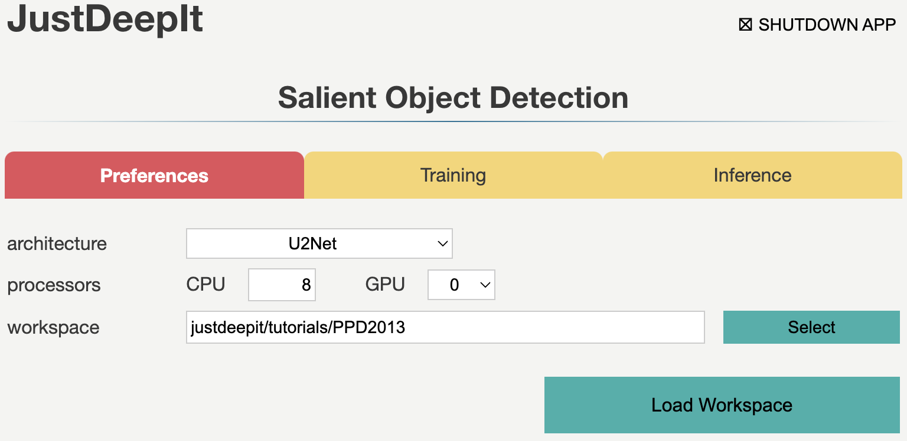
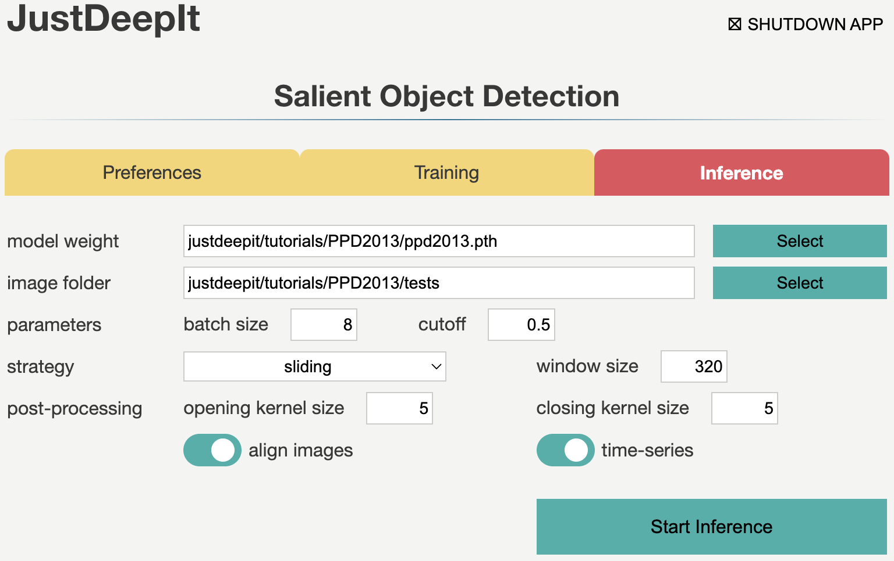
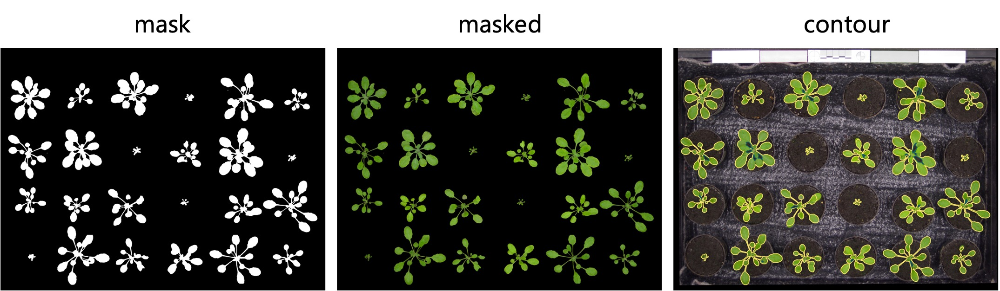

==================
Plant segmentation
==================

Phenotyping is important to plant science
because of its applications in breeding and crop management. 
It relies on leaf detection and leaf segmentation.
This is because leaf color is used to estimate nutritional status,
while area index is used to measure plant growth and estimate final yield.
In this tutorial, we illustrate the use of JustDeepIt
to train U2-Net\ [#u2net]_ and apply the trained model to leaf segmentation.

Dataset preparation
===================

The dataset used in this case study can be downloaded from
Computer Vision Problems in `Plant Phenotyping CVPPP (CVPPP 2017 Challenges) <https://www.plant-phenotyping.org/CVPPP2017-challenge>`_.
The dataset is intended for developing and evaluating methods for plant detection,
localization, segmentation, and other tasks.
The original dataset is grouped into three levels: ray, stack, and plant.
Level tray contains images of trays, including multiple plants compiled by annotations,
while levels stack and plant contain images of a single plant,
with the former containing stacks and the latter containing only plants.
In this study, we use the images at level tray for training and plant segmentation.

The dataset contains 27 tray-level images with filenames :file:`ara2013_tray*_rgb.png`
where * represents digits from 01 to 27.
We create folders :file:`train` and :file:`test`
in the workspace (:file:`PPD2013`) to store the training and test images, respectively.
We copy four images with the corresponding masks, tray01, tray09, tray18, and tray27,
into folder :file:`train`
and all the images without masks into folder :file:`test`.

The above dataset preparation can be performed manually or automatically using the following shell scripts:

.. include:: ../../../tutorials/PPD2013/README.rst
    :start-after: <dataset>
    :end-before: </dataset>

Settings
========

To start JustDeepIt, we open the terminal and run the following command.
Then, we open the web browser, access to \http://127.0.0.1:8000,
and start "Salient Object Detection" mode.

.. code-block:: sh

    justdeepit
    # INFO:uvicorn.error:Started server process [61]
    # INFO:uvicorn.error:Waiting for application startup.
    # INFO:uvicorn.error:Application startup complete.
    # INFO:uvicorn.error:Uvicorn running on http://127.0.0.1:8000 (Press CTRL+C to quit)

We set the **workspace** to the location containing folders
:file:`train` and :file:`test`,
and press **Load Workspace** button.
Note that the value of **workspace** may be different from
the screenshot below depending on user's environment.

After loading workspace,
the functions of the **Training** and **Inference** become available.

Trainig
=======

To train the model, 
we select tab **Training**
and specify **model weight** as the location to store the training weight
and **image folder** as the folder (i.e., :file:`train`)
containing training images and masks (i.e., annotation labels).
Then, we set the suffixes of the training images and mask to ``_rgb.png`` and ``_fg.png``, respectively.
The other parameters are set as shown in the screenshot below.
Note that the values of **model weight** and **image folder** may be different
from the screenshot depending on user's environment.

.. image:: ../_static/tutorials_PPD2013_train.png
    :align: center

As the images in this dataset have a resolution of 3108 x 2324 pixels
and each image contains 24 plants,
the training images are large and capture many small objects.
Thus, *random cropping* strategy is the suitable selection for training
(see :ref:`sodtrainingstrategy` for details).
Here we set JustDeepIt to crop areas of 320 x 320 pixels for training.
As *random cropping* is applied once per image and epoch and only four training images were available,
we require many epochs (1,000 epochs in this case study) for training
to ensure a high detection performance.
After setting the parameters as in the screenshot below,
we press **Start Training** button to start model training.

Inference
=========

In tab **Inference**,
we specify **model weight** to the training weights,
whose file usually has extension :file:`.pth`,
**image folder** as the folder containing images for detection (i.e., :file:`test`),
and the other parameters as shown in the screenshot below.
The values of **model weight** and **image folder** may be different
from the screenshot depending on user's environment.

Note that, to summarize objects over time, we activate option **time-series**.
In addition, to align plants in each image through time-series by location,
we activate option **align images**.
In addition, as we trained the model on areas of 320 x 320 pixels
that were randomly cropped from the original image,
we also need input of the same size and scale
for the model to ensure the high detection performance.
Thus, during detection,
we use the *sliding* approach (see :ref:`soddetectionstrategy` for details)
to crop areas of 320 x 320 pixels
from the top left to the bottom right of the original image,
performe salient object detection for all the areas,
and finally merge the detection results into a single image. 

Then, we press **Start Inference** button to perform
salient object detection (i.e., plant segmentation).
The results of prediction and summarization were saved
in the **workspace** as specified in tab **Preferences**.

JustDeepIt generates three types of images:
mask, masked, and contour during the inference process,
as respectively shown in the images below.

Downstream analyses
===================

The time-series images can be aligned to generate videos 
using third-party software such as :command:`ffmpeg` command,
free GUI software, and online service.

.. raw:: html
    
    <video width="100%" style="margin-bottom:1.5em;" controls muted >
        <source src="../_static/tutorials_PPD2013_inference_output_movie.mp4" type="video/mp4" />
        Your browser does not support the video tag.
    </video>

Further, the identification of each object (each plant in this case)
is automatically assigned over time, as shown in the image below.
Hence, the same identifier is assigned to objects
that are almost at the same position across the images.
This is because we turned on **time-series** and **align images** option during detection processes.
In this case study, 27 images containing 24 plants per image are used,
and thus the detected objects are identified from 1 to 24.

Information about each object,
such as the coordinates of center position, radius, size, and color in RGB, HSV, and L*a*b* color spaces
will be recorded in :file:`*.objects.tsv` files in the workspace :file:`justdeepitws/outputs` folder.
Python or R can be used to visualize summarization results,
such as the projected area of each plant and the color of each plant over time.

References
==========

.. [#u2net] Qin X, Zhang Z, Huang C, Dehghan M, Zaiane O R, Jagersand M. U2-Net: Going Deeper with Nested U-Structure for Salient Object Detection. https://doi.org/10.1016/j.patcog.2020.107404

