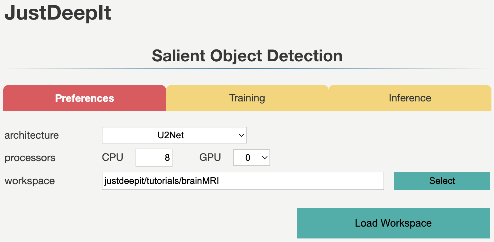
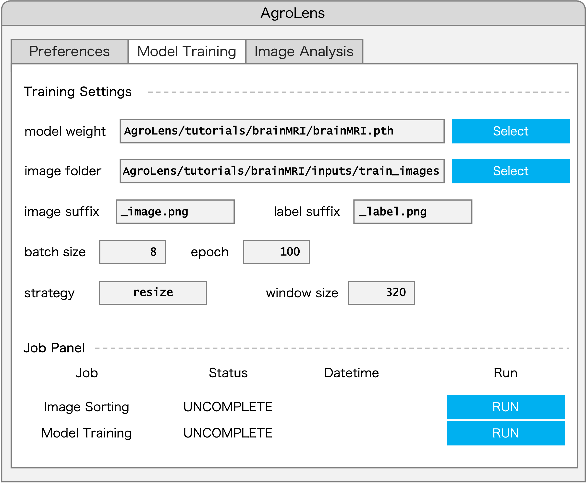
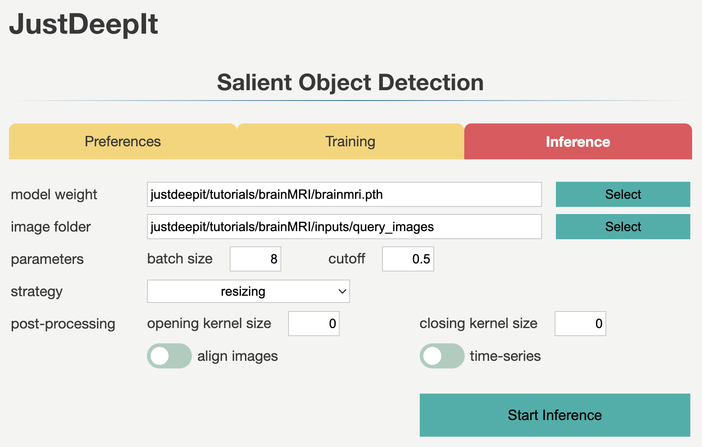
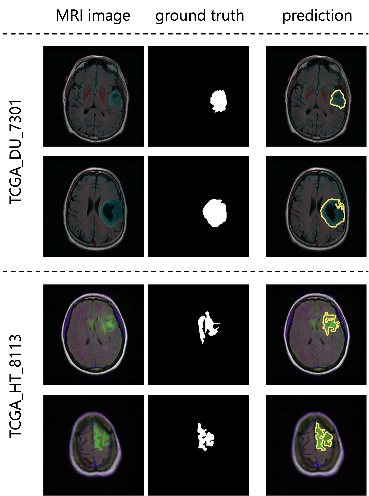

=================================
Tumor Detection (U\ :sup:`2`-Net)
=================================

Deep learning is widely used in a variety of fields.
For instance, it is used in medicine to detect tumors in magnetic resonance imaging (MRI) and X-ray scans.
In fact, deep learning models can detect tumors that may be overlooked by humans.
This tutorial illustrates the training of U\ :sup:`2`-Net [#u2net]_ on the TCGA dataset of brain MRI scans
and then uses the trained model to perform tumor detection,
demonstrating the use of the proposed JustDeepIt for applications beyond plant biology and agriculture.

Preparation
===========

The dataset used in this case study named LGG Segmentation Dataset
which can be downloaded from `Kaggle (LGG Segmentation Dataset) <https://www.kaggle.com/mateuszbuda/lgg-mri-segmentation/version/1>`_.
The dataset contains MRI scans from 110 patients and mask images of tumor areas in the TIFF format.
We randomly select images from about 90% of patients for validation and used the remaining images for training.
To prepare for training and validation,
we copy all the training images and mask images in folder :file:`brainMRI/inputs/train_images`
and all the validation images in folder :file:`brainMRI/inputs/query_images`.

The above dataset preparation can be performed manually or automatically using the following shell scripts:

.. include:: ../../../tutorials/brainMRI/README.rst
    :start-after: <dataset>
    :end-before: </dataset>

Settings
========

To start JustDeepIt, we open the terminal and run the following command.
Then, we open the web browser and accesss to \http://127.0.0.1:8000.

.. code-block:: sh

    justdeepit
    # INFO:uvicorn.error:Started server process [61]
    # INFO:uvicorn.error:Waiting for application startup.
    # INFO:uvicorn.error:Application startup complete.
    # INFO:uvicorn.error:Uvicorn running on http://127.0.0.1:8000 (Press CTRL+C to quit)

After loading workspace, the functions of the model training and object detection become available.

Trainig
=======

To train the model,
we select tab **Training**
and then specify **model weight** as the location to store the training weight
and **image folder** as the folder (i.e., :file:`train_images`)
containing training images and masks (i.e., annotation labels).
Then, we set the suffixes of the training images and mask to ``_image.tif`` and ``_mask.tif``, respectively.

The images in the dataset have a resolution of 256 x 256 pixels,
which approximately equals to the input size of U\ :sup:`2`-Net (288 x 288)
and only contains one or two tumor regions.
Here, *resizing* is the suitable selection for training.
As there are many traning images, we set a small number of epochs (e.g. 100) for training in this case.
After setting the parameters as in the images below,
we execute image sorting and model training by pressing **Start Training** buttons.

Inference
=========

In tab **Inference**,
we specify **model weight** to the training weights,
whose file usually has extension :file:`.pth`,
**query images** to the folder containing images for detection (i.e., :file:`query_images`),
and the other parameters as shown in the image below.

As we trained the model with *resizing* approach,
we should use the corresponding approach, *resizing*, in the inference process.
Then, we press **Start Inference** buttons for segmentation.
The prediction results and summarization will be saved in the **workspace** as specified in tab **Preferences**.

Results
=======

Examples of segmentation results are shown in the figure below.

References
==========

.. [#u2net] Qin X, Zhang Z, Huang C, Dehghan M, Zaiane O R, Jagersand M. U2-Net: Going Deeper with Nested U-Structure for Salient Object Detection. https://doi.org/10.1016/j.patcog.2020.107404

