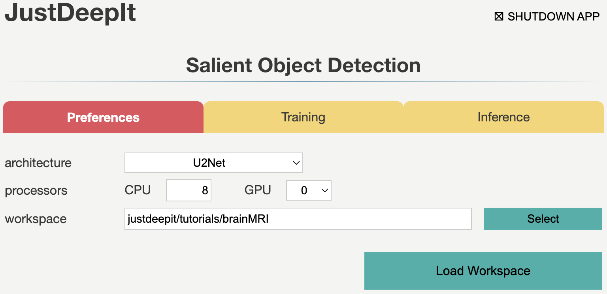
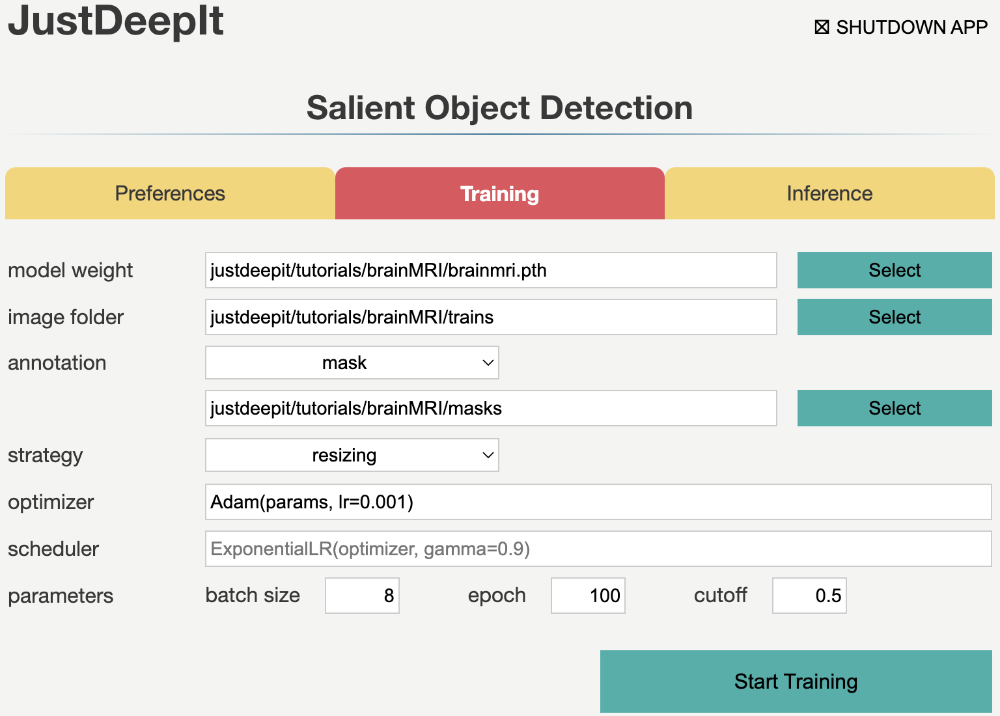

===============
Tumor detection
===============

Deep learning is widely used in a variety of fields.
For instance, it is used in medicine to detect tumors in magnetic resonance imaging (MRI) and X-ray scans.
In fact, deep learning models can detect tumors that may be overlooked by humans.
This tutorial illustrates the training of U\ :sup:`2`-Net [#u2net]_ on the TCGA dataset of brain MRI scans
and then uses the trained model to perform tumor detection.

Preparation
===========

The dataset used in this case study named LGG Segmentation Dataset
which can be downloaded from `Kaggle (LGG Segmentation Dataset) <https://www.kaggle.com/mateuszbuda/lgg-mri-segmentation/version/1>`_.
The dataset contains MRI scans from 110 patients
and mask images of tumor areas in the TIFF format.
The MRI scan and mask images are named, respectively,
such as TCGA_DU_7013_19860523_32.tif and TCGA_DU_7013_19860523_33_mask.tif.
We randomly select images from about 90% of patients for training
and use the remaining patients' images for validation.
To prepare for training and validation,
we copy all the training images and mask images into folder :file:`train`
and all the validation images into folder :file:`test`.
Note that, to clearly distinguish the MRI scan images and mask images,
we add the suffix :file:`_image.tif` to the MRI scan images during the copy.
The above dataset preparation can be performed manually
or automatically using the following shell scripts:

.. include:: ../../../tutorials/brainMRI/README.rst
    :start-after: <dataset>
    :end-before: </dataset>

Settings
========

To start JustDeepIt, we open the terminal and run the following command.
Then, we open the web browser, access to \http://127.0.0.1:8000,
and start "Salient Object Detection" mode.

.. code-block:: sh

    justdeepit
    # INFO:uvicorn.error:Started server process [61]
    # INFO:uvicorn.error:Waiting for application startup.
    # INFO:uvicorn.error:Application startup complete.
    # INFO:uvicorn.error:Uvicorn running on http://127.0.0.1:8000 (Press CTRL+C to quit)

We set the **workspace** to the location containing folders
:file:`train` and :file:`test`,
and press **Load Workspace** button.
Note that the value of **workspace** may be different from
the screenshot below depending on user's environment.

After loading workspace, the functions of the **training**
and **inference** become available.

Trainig
=======

To train the model,
we select tab **Training**
and then specify **model weight** as the location to store the training weight
and **image folder** as the folder (i.e., :file:`train`)
containing training images and masks (i.e., annotation labels).
Then, we set the suffixes of the training images and mask to ``_image.tif`` and ``_mask.tif``, respectively.
The other parameters are set as shown in the screenshot below.
Note that the values of **model weight** and **image folder** may be different
from the screenshot depending on user's environment.

The images in this dataset have a resolution of 256 x 256 pixels
which approximately equals to the input size of U\ :sup:`2`-Net (288 x 288)
and each image only contains several tumor regions.
Here, *resizing* is the suitable selection for training (see :ref:`sodtrainingstrategy` for details).
As there are many traning images, we set a small number of epochs (e.g. 100) for training in this case.
After setting the parameters as in the screenshot below,
we execute model training by pressing **Start Training** button.

Inference
=========

In tab **Inference**,
we specify **model weight** to the training weights,
whose file usually has extension :file:`.pth`,
**image folder** to the folder containing images for detection (i.e., :file:`test`),
and the other parameters as shown in the screenshot below.
Note that the values of **model weight** and **image folder** may be different
from the screenshot depending on user's environment.

.. image:: ../_static/tutorials_brainMRI_eval.png
    :align: center

As we trained the model with *resizing* approach,
we should use the corresponding approach, *resizing*, in the inference process
(see :ref:`soddetectionstrategy` for details).
Then, we press **Start Inference** button for segmentation.
The results of prediction and summarization will be saved in the **workspace**
as specified in tab **Preferences**.
Examples of segmentation results are shown in the figure below.

References
==========

.. [#u2net] Qin X, Zhang Z, Huang C, Dehghan M, Zaiane O R, Jagersand M. U2-Net: Going Deeper with Nested U-Structure for Salient Object Detection. https://doi.org/10.1016/j.patcog.2020.107404

