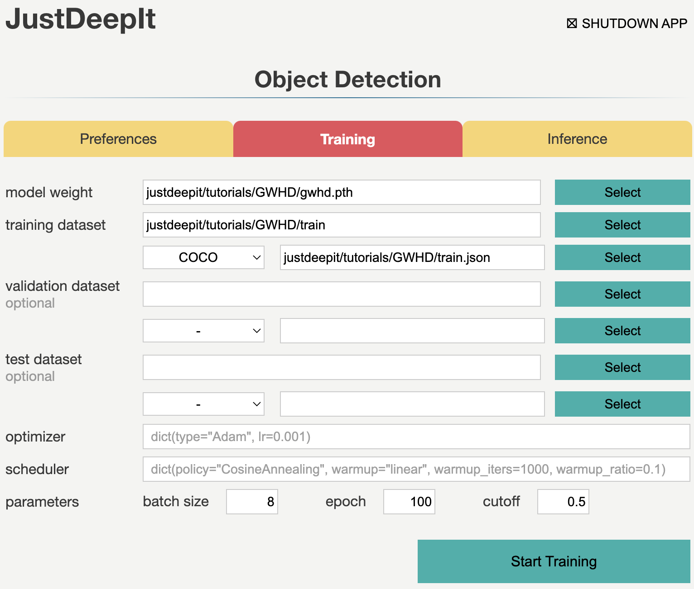

===================================
Wheat Head Detection (Faster R-CNN)
===================================

Heading is a key phenological stage during growth of most crops
because it reflects the transition from the vegetative growth stage to the reproductive stage.
Monitoring heading helps researchers understand the interactions
between growth stages and environments.
Furthermore, it supports farmers in management activities,
such as making decisions about a treatment to be applied.
Detecting crop heads from images captured by fixed-point cameras or drones
allows to conduct high-throughput phenotyping and efficiently run large farms.
Deep learning technology has become more common for various detection tasks.
For instance, in this tutorial, we use JustDeepIt to train Faster R-CNN\ [#fasterrcnn]_ for wheat head detection.

Dataset Preparation
===================

The global wheat head detection (GWHD) dataset is a large-scale dataset
used for wheat head detection\ [#gwhd]_.
The images in the GWHD dataset were taken from various cultivars
growing in different environments worldwide.
Detailed descriptions of the GWHD dataset and instructions for downloading
are available on the `Global Wheat website <http://www.global-wheat.com/>`_
and `AIcrowd Global Wheat Challenge 2021 <https://www.aicrowd.com/challenges/global-wheat-challenge-2021>`_.

Following the dataset instructions written in
`AIcrowd Global Wheat Challenge 2021 <https://www.aicrowd.com/challenges/global-wheat-challenge-2021>`_,
we download files :file:`train.zip` and :file:`test.zip`.
By decompressing file :file:`train.zip`, we obtaine folder :file:`train` and file :file:`train.csv`.
Folder :file:`train` contains images of wheat heads,
and file :file:`train.csv` contains the bounding-box coordinates of wheat heads
for each image in folder :file:`train`.
Then, we decompress :file:`test.zip` to obtain folder :file:`test` which contains test images.

As JustDeepIt requires annotations in the COCO format,
we first convert file :file:`train.csv` into a file in the COCO format (:file:`train.json`).
Python script :file:`gwhd2coco.py` stored in GitHub
(`JustDeepIt/tutorials/GWHD/scripts <https://github.com/biunit/JustDeepIt/tree/main/tutorials/GWHD/scripts>`_) can be used for format conversion.
In addition, JustDeepIt requires a text file containing class names.
We create file :file:`class_label.txt` containing only "spike" on the first line,
as the GWHD dataset only has one class, namely, wheat head.

The above dataset preparation can be performed manually or automatically using the following shell scripts:

.. include:: ../../../tutorials/GWHD/README.rst
    :start-after: .. <dataset>
    :end-before: .. </dataset>

Settings
========

To start JustDeepIt, we open the terminal and run the following command.
Then, we open the web browser, access to \http://127.0.0.1:8000,
and start "Object Detection" mode.

.. code-block:: sh

    justdeepit
    # INFO:uvicorn.error:Started server process [61]
    # INFO:uvicorn.error:Waiting for application startup.
    # INFO:uvicorn.error:Application startup complete.
    # INFO:uvicorn.error:Uvicorn running on http://127.0.0.1:8000 (Press CTRL+C to quit)

We set the **architecture** to Faster R-CNN,
the **workspace** to the location containing folder :file:`train` and file :file:`train.json`,
and the other parameters as shown in the screenshot below.
Note that the value of **workspace** may be different from the screenshot
depending on user's environment.
Then, we press button **Load Workspace**.

Once the workspace is set, the functions of model training and inference become available.

Training
========

To train the model,
we select tab **Training**
and specify the **model weight** as the location storing the training weights,
**image folder** as the folder containing training images (i.e., :file:`train`),
**annotation** format as the format of the annotation file (COCO in this case),
and **annotation** as the file of image annotations (i.e., :file:`train.json`).
The other parameters are set as shown in screenshot below.
Note that the values of **model weight**, **image folder**, and **annotation** may be
different from the screenshot depending on user's environment.
Then, we press button **Start Training** for model training.

Training takes 1-2 days, and it depends on the computer hardware.

Inference
=========

In tab **Inference**, the **model weight** is specified to the training weights,
whose file extension is :file:`pth` in general.
Then, we specify **image folder** to the folder containing the images for detection
(i.e., :file:`test`),
and other parameters as shown in screenshot below.
Note that the values of **model weight** and **image folder** may be
different from the screenshot depending on user's environment.
Next, we press button **Start Inference** for object detection.

The detection results will be stored in folder :file:`justdeepitws/outputs` of the workspace
as images with bounding boxes and a JSON file in the COCO format (:file:`annotation.json`).

Results
=======   

Examples of wheat head detection results are shown in the figure below.

API
====

Model training and object detection can be performed using the JustDeepIt API.
Python script :file:`run_mmdet.py` stored in GitHub
(`JustDeepIt/tutorials/GWHD/scripts <https://github.com/biunit/JustDeepIt/tree/main/tutorials/GWHD/scripts>`_) can be used for this purpose.
See GitHub (`JustDeepIt/tutorials/GWHD/ <https://github.com/biunit/JustDeepIt/tree/main/tutorials/GWHD>`_) for detailed information.

.. include:: ../../../tutorials/GWHD/README.rst
    :start-after: .. 
    

References
==========

.. [#fasterrcnn] Ren S, He K, Girshick R, Sun J. Faster R-CNN: Towards Real-Time Object Detection with Region Proposal Networks. https://arxiv.org/abs/1506.01497
.. [#gwhd] David E, Madec S, Sadeghi-Tehran P, Aasen H, Zheng B, Liu S, Kirchgessner N, Ishikawa G, Nagasawa K, Badhon M A, Pozniak C, Solan B, Hund A, Chapman S C, Baret F, Stavness I, Guo W. Global Wheat Head Detection (GWHD) Dataset: A Large and Diverse Dataset of High-Resolution RGB-Labelled Images to Develop and Benchmark Wheat Head Detection Methods. https://doi.org/10.34133/2020/3521852

